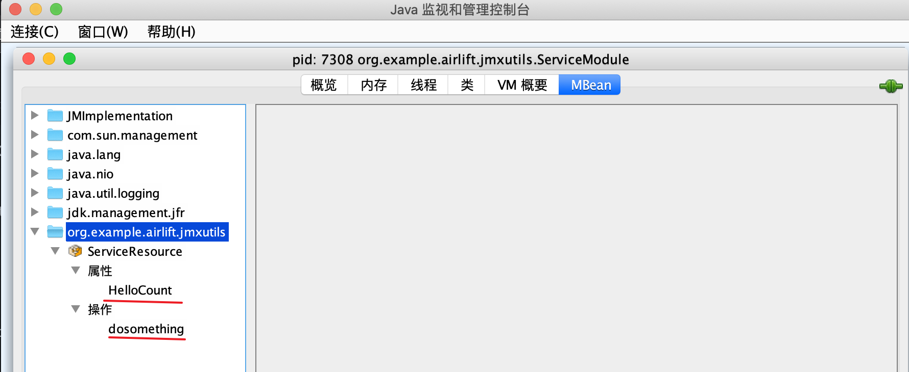

# 基础框架 Airlift

---

[Airlift](https://github.com/airlift/airlift) 是 Trino 的系统基础，是一个用 Java 构建 REST 服务的轻量级框架。Airlift 并不是像 Spring 一样的重量级框架，相反，它像是由一组开源工具组成的工具包，将来自 Java 生态系统的稳定、成熟的库汇集到一个简单、轻量级的包中，让您专注于完成工作，并包括对配置、指标、日志记录、依赖注入等的内置支持，使开发者能够在最短的时间内交付生产质量的 Web 服务。

Airlift 包含以下标准开源库:

| Library                                                 | Domain                                           |
| :------------------------------------------------------ | :----------------------------------------------- |
| [Jetty](https://www.eclipse.org/jetty/)                 | Industry standard HTTP server and client         |
| [JAX-RS/Jersey](https://eclipse-ee4j.github.io/jersey/) | The Java standard for REST servers               |
| [Jackson](https://github.com/FasterXML/jackson)         | Industry standard JSON serialization             |
| [Guava](https://github.com/google/guava)                | Swiss army knife for Java                        |
| [Guice](https://github.com/google/guice)                | The best dependency injection framework for Java |
| [jmxutils](https://github.com/martint/jmxutils)         | Simple library for exposing JMX endpoints        |


## 监控

---

Airlift 包含 [jmxutils](https://github.com/martint/jmxutils)，可以非常方便地暴露 JMX 指标**(具体使用可看jmxutils中的example)**。

首先我们在 pom.xml 中添加必备的依赖项:

```xml
<dependency>
  <groupId>org.weakref</groupId>
  <artifactId>jmxutils</artifactId>
</dependency>

<dependency>
  <groupId>io.airlift</groupId>
  <artifactId>jmx</artifactId>
</dependency>

<dependency>
  <groupId>io.airlift</groupId>
  <artifactId>jmx-http</artifactId>
</dependency>

<dependency>
  <groupId>io.airlift</groupId>
  <artifactId>jmx-http-rpc</artifactId>
</dependency>
```

我们可以通过 @Managed对外暴露出一些指标。

```java
package org.example.airlift.jmxutils;

import org.weakref.jmx.Managed;

public class ServiceResource {

    @Managed
    public int getHelloCount()
    {
        return 4;
    }

    @Managed
    public void dosomething(){

    }
}

```

最后，在 module 上注册绑定。

```java
package org.example.airlift.jmxutils;

import com.google.inject.Binder;

import com.google.inject.Injector;
import com.google.inject.Module;
import io.airlift.bootstrap.Bootstrap;
import org.weakref.jmx.guice.MBeanModule;

import javax.management.MBeanServer;

import java.lang.management.ManagementFactory;

import static org.weakref.jmx.guice.ExportBinder.newExporter;

public class ServiceModule implements Module {
    @Override
    public void configure(Binder binder) {
        binder.bind(MBeanServer.class).toInstance(ManagementFactory.getPlatformMBeanServer());
        binder.bind(ServiceResource.class);
        newExporter(binder).export(ServiceResource.class).withGeneratedName();
    }


    public static void main(String[] args) {

        Bootstrap bootstrap = new Bootstrap(new MBeanModule(), new ServiceModule());
        Injector injector = bootstrap.initialize();

        while(true){

        }

    }
}

```

启动服务后，通过 jconsole查看。




## 日志

----

Airlift 包含了一个简单的日志 API 基于 JDK 的 logging 包。

首先，我们添加日志的 maven 依赖。

```xml
<dependency>
  <groupId>io.airlift</groupId>
  <artifactId>log</artifactId>
</dependency>

<dependency>
  <groupId>io.airlift</groupId>
  <artifactId>log-manager</artifactId>
</dependency>
```

然后，我们在 ServiceResource 中打印日志。

```java
package org.example;

import io.airlift.log.Logger;

import javax.inject.Inject;
import javax.ws.rs.GET;
import javax.ws.rs.Path;
import javax.ws.rs.Produces;
import javax.ws.rs.core.MediaType;

@Path("/v1/service")
public class ServiceResource
{
    // 获取logger
    private static final Logger LOG = Logger.get(ServiceResource.class);
    private final ServiceConfig config;

    @Inject
    public ServiceResource(ServiceConfig config)
    {
        this.config = config;
    }

    @GET
    @Produces(MediaType.APPLICATION_JSON)
    public String hello()
    {
        String message = config.getHelloMessage();
        // 打印日志
        LOG.info("call Hello Function and return %s", message);
        return message;
    }
}

```

最后，在配置文件 config.properties 中添加日志打印的相关配置。

```properties
# etc/config.properties

## log
# 格式可以是text或json，json格式时，会被打印成一行
log.format=json 
# 可以是本地文件，也可以通过tcp传输，tcp时配置格式为tcp://<host>:<port>
log.output-file=var/log/server.log 
# 可以向日志中添加环境参数
log.annotation-file=etc/annotations.properties

# etc/annotations.properties
hostIp=${ENV:HOST_IP}
podName=${ENV:POD_NAME}
```

日志样例如下:

```json
{
  "timestamp": "2021-12-06T16:23:41.352519093Z",
  "level": "DEBUG",
  "thread": "main",
  "logger": "TestLogger",
  "message": "Test Log Message",
  "annotations": {
    "hostIp": "127.0.0.1",
    "podName": "mypod"
  }
}
```

