# presto查询流程的原理

---


> 注：本文参考知乎这篇文章，https://zhuanlan.zhihu.com/p/293775390
>
> 本文的trino版本是423

## 1.从架构上看SQL Query的执行流程

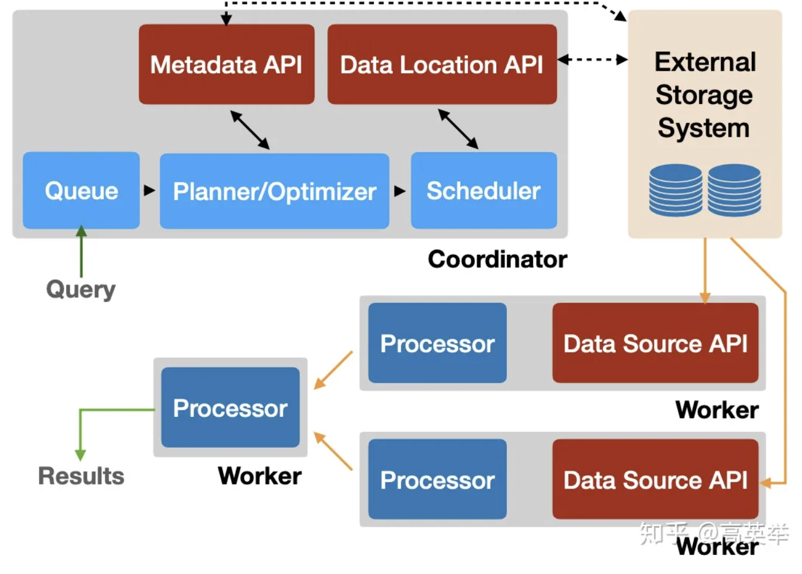

请参见上面的架构图，从用户开始写SQL开始到查询结果返回，我们划分出以下几个部分：

- SQL Client：用户可以在这里输入SQL，它负责提交SQL Query给Presto集群。SQL Client一般用Presto自带的Presto Client比较多，它可以处理分批返回的结果，并在终端展示给用户。
- External Storage System：由于Presto自身不存储数据，计算涉及到的数据及元数据都来自于外部存储系统，如HDFS，AWS S3等分布式系统。在企业实践经验中，经常使用HiveMetaStore来存存储元数据，使用HDFS来存储数据，通过Presto执行计算的方式来加快Hive表查询速度。
- Presto Coordinator：负责接收SQL Query，生成执行计划，拆分Stage和Task，调度分布式执行的任务到Presto Worker上。
- Presto Worker：负责执行收到的HttpRemoteTask，根据执行计划确定好都有哪些Operator以及它们的执行顺序，之后通过TaskExecutor和Driver完成所有Operator的计算。如果第一个要执行的Operator是SourceOperator，当前Task会先从External Storage System中拉取数据再进行后续的计算。如果最后一个执行的Operator是TaskOutputOperator，当前Task会将计算结果输出到OutputBuffer，等待依赖当前Stage的Stage来拉取结算结果。整个Query的所有Stage中的所有Task执行完后，将最终结果返回给SQL Client。

> 至此，有几点疑问：
>
> - 怎么生成AST的
> - 逻辑计划与执行计划是怎么生成的
> - stage是怎么划分的
> - presto生成task后是怎么调度到worker中的


## 2. 从代码中看SQL执行流程

先介绍两个概念：

- SQL是声明式的（declarative）：声明式指的是你描述的就是你想要的结果而不是计算的过程，如数据工程师用SQL完成数据计算时既是如此。与之相反的是过程式的，如你写一段Java代码，通篇都是在描述如何完成计算的过程，而只有到了结尾才return你想要的结果。声明式可以说是结果导向的，它不关心实现过程，所以普遍来说，写SQL比写Java代码更简单易懂，更容易上手，甚至可以面向没有编程经验的数据分析师。
- 执行计划（Execution Plan）：但是SQL背后的实现过程，总得有代码去实现吧，而且在很多情况下还要兼顾功能、性能、成本等因素，可以说是非常复杂的，这就是SQL的执行引擎需要去考虑和实现的。既然SQL是声明式的，不关心实现过程，那么SQL执行引擎如何才能知道具体的执行步骤和细节呢？这里就需要引入一个执行计划的概念，它描述的是SQL执行的详细步骤和细节，SQL执行引擎只要按照执行计划执行即可完成整个计算过程。当然在这之前，SQL执行引擎需要做的第一件事是先解析SQL，生成SQL对应的执行计划。

以上两个概念，套用到任意类SQL的执行系统都是适用的，例如MySQL，Hive，SparkSQL，Clickhouse。具体而言，对于Presto来说，它的SQL执行过程可以详细拆解为以下几个步骤：

- 第一步：【Coordinator】接收SQL Query请求
- 第二步：【Coordinator】词法与语法分析（生成AST）
- 第三步：【Coordinator】创建和启动QueryExecution
- 第四步：【Coordinator】语义分析(Analysis)、生成执行计划LogicalPlan
- 第五步：【Coordinator】优化执行计划，生成Optimized Logical Plan
- 第六步：【Coordinator】为逻辑执行计划分段(PlanFragment)
- 第七步：【Coordinator】创建SqlStageExecution（创建Stage）
- 第八步：【Coordinator】Stage调度-生成HttpRemoteTask并分发到Presto Worker
- 第九步：【Worker】在Presto Worker上执行任务，生成Query结果
- 第十步：【Coordinator】分批返回Query计算结果给SQL客户端

从第一步到第八步，主要描述的是Presto对一个传入的SQL语句如何进行解析并生成最终的执行计划，生成Query执行计划的主要流程如下图所示：

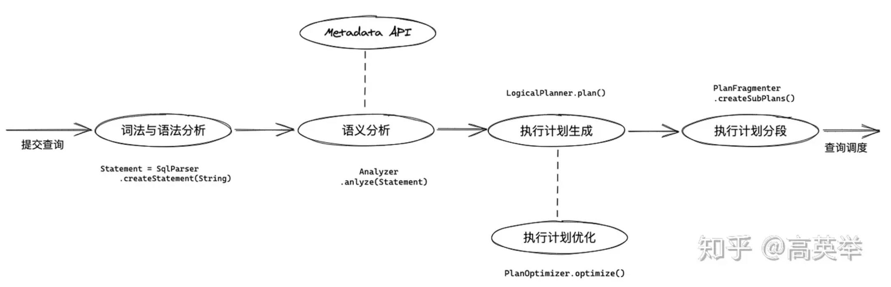

可以看到，自第一步至第九步，全部是在Presto Coodinator上完成，足见Coordinator的核心地位，阅读Presto源码时你也会发现它的代码是极其复杂的，我前前后后阅读了十几遍，debug了几十遍才有了今天的这份自信来将我的经验输出到互联网上帮助你更高效的掌握它；第十步是在Presto Worker上执行；第十一步是在Presto Coordinator上执行，并将查询结果分批返回给客户端(如Presto SQL Client或者其他JDBC客户端)。

接下来几个章节我们也会逐一详细介绍以上的每个步骤，这里先对每一步做一些概要介绍。


## 3. SQL执行分步拆解

> **为了能够让内容更具体生动，我们选了一个典型的SQL，TPC-DS的Query55，以它为例来介绍SQL执行过程。**

假设现在有一个Presto用户，在Presto-Cli里面输入SQL，然后提交执行：

```sql
use tpcds.sf1;

-- For a given year, month and store manager calculate the total store sales of any combination all brands.
select i_brand_id as brand_id, i_brand as brand,
        sum(ss_ext_sales_price) as ext_price
from date_dim, store_sales, item
where d_date_sk = ss_sold_date_sk
        and ss_item_sk = i_item_sk
        and i_manager_id=82
        and d_moy=8
        and d_year=1999
group by i_brand, i_brand_id
order by ext_price desc, i_brand_id
limit 10;
```

简介：在TPC-DS的数据模型中，store_sales是事实表，date_dim与item是维度表。上面SQL的业务含义是对商店销售数据的分品牌统计。

### **3.1 第一步：【Coordinator】接收SQL Query请求**

Presto-Cli提交的Query，会以HTTP POST的方式请求到Presto集群的Coordinator。请求体中携带了SQL以及其他信息。

```bash
## Request Method/URI:
POST /v1/statement

## Headers：
X-Presto-Catalog = tpcds
X-Presto-Schema = sf1

## Request Body:

select i_brand_id as brand_id, i_brand as brand,
        sum(ss_ext_sales_price) as ext_price
from date_dim, store_sales, item
where d_date_sk = ss_sold_date_sk
        and ss_item_sk = i_item_sk
        and i_manager_id=82
        and d_moy=8
        and d_year=1999
group by i_brand, i_brand_id
order by ext_price desc, i_brand_id
limit 10;
```


Presto-Cli发起第一次HTTP请求，在Coordinator上，QueuedStatementResource接收Presto-Cli发来的HTTP Query请求后，生成QueryId，将Query加入待执行队列，返回Response告知Presto-Cli。

```java
		//@Path("/v1/statement")
		//QueuedStatementResource
		@ResourceSecurity(AUTHENTICATED_USER)
    @POST
    @Produces(APPLICATION_JSON)
    public Response postStatement(
            String statement,
            @Context HttpServletRequest servletRequest,
            @Context HttpHeaders httpHeaders,
            @Context UriInfo uriInfo)
    {
        if (isNullOrEmpty(statement)) {
            throw badRequest(BAD_REQUEST, "SQL statement is empty");
        }
				//registerQuery中生成的queryID，并且将Query加入待执行队列
        Query query = registerQuery(statement, servletRequest, httpHeaders);
				//返回的Response中包含了nextURI，所以第二次请求直接get这个nextURI，见下图所示
        return createQueryResultsResponse(query.getQueryResults(query.getLastToken(), uriInfo));
    }


//QueuedStatementResource::registerQuery()
private Query registerQuery(String statement, HttpServletRequest servletRequest, HttpHeaders httpHeaders)
    {
        // ...
  			//生成的query中包含了queryID
        Query query = new Query(statement, sessionContext, dispatchManager, queryInfoUrlFactory, tracer);
  			//将query加入待执行队列
        queryManager.registerQuery(query);
				
  			// ...
        return query;
    }
```

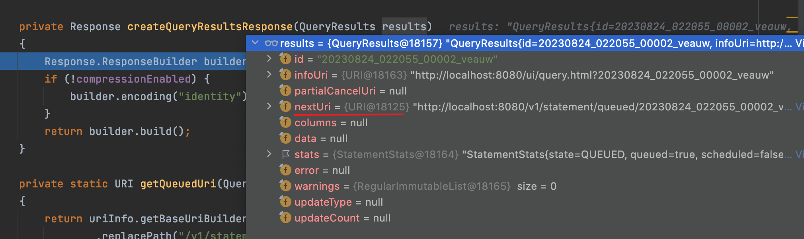


紧接着Presto-Cli发起第二次HTTP请求，Presto处理此请求时，会真正把Query提交到DispatchManager::createQueryInternal()执行

```java
		//QueuedStatementResource
		@ResourceSecurity(PUBLIC)
    @GET
    @Path("queued/{queryId}/{slug}/{token}")
    @Produces(APPLICATION_JSON)
    public void getStatus(
            @PathParam("queryId") QueryId queryId,
            @PathParam("slug") String slug,
            @PathParam("token") long token,
            @QueryParam("maxWait") Duration maxWait,
            @Context UriInfo uriInfo,
            @Suspended AsyncResponse asyncResponse)
    {
        Query query = getQuery(queryId, slug, token);
				//在getStatus中最终会调用到DispatchManager::createQueryInternal()执行
        ListenableFuture<Response> future = getStatus(query, token, maxWait, uriInfo);
        bindAsyncResponse(asyncResponse, future, responseExecutor);
    }
```

> 备注：Slug与Token只是Presto用来验证接收到的请求是否是合法，slug在生成后就不会变，token在生成nextUrl的逻辑中，每次会token+1，这些不是我们关注的重点，可以忽略。

**DispatchManager::createQueryInternal()的执行流程是：**

```java
private <C> void createQueryInternal(QueryId queryId, Span querySpan, Slug slug, SessionContext sessionContext, String query, ResourceGroupManager<C> resourceGroupManager)
    {
        		//...

            // 第一步：获取Query对应的Session
            session = sessionSupplier.createSession(queryId, querySpan, sessionContext);

            // 第二步：检查是否有权限执行Query
            accessControl.checkCanExecuteQuery(sessionContext.getIdentity());

            // 第三步（对应SQL执行流程第二步，后面小节详细介绍）：prepareQuery负责调用SqlParser完成SQL的						  //解析，生成抽象语法树（AST）
            preparedQuery = queryPreparer.prepareQuery(session, query);

            // 第四步：选择Query执行对应的ResourceGroup
            SelectionContext<C> selectionContext = resourceGroupManager.selectGroup(...);

  					// 第五步：生成DispatchQuery
            DispatchQuery dispatchQuery = dispatchQueryFactory.createDispatchQuery(
                    session,
                    sessionContext.getTransactionId(),
                    query,
                    preparedQuery,
                    slug,
                    selectionContext.getResourceGroupId());
  
						// 第六步：向ResourceGroupManager提交Query执行
            boolean queryAdded = queryCreated(dispatchQuery);
            if (queryAdded && !dispatchQuery.isDone()) {
                try {
                    resourceGroupManager.submit(dispatchQuery, selectionContext, dispatchExecutor);
                }
                catch (Throwable e) {
                    // dispatch query has already been registered, so just fail it directly
                    dispatchQuery.fail(e);
                }
            }
        }
    }
```


### **3.2 第二步：【Coordinator】词法与语法分析（生成AST）**

在这一步中，SqlParser拿到一个SQL字符串，通过词法语法解析后，生成抽象语法树（AST）。

SqlParser的实现，使用了Antlr4作为解析工具。它首先定义了Antlr4的SQL语法文件（即SqlBase.g4)，之后用它的代码生成工具自动生成了超过13K行SQL解析逻辑。SQL解析完成后会生成AST。

> 注：词法分析与语法分析都是由Antlr4生成，见下图所示

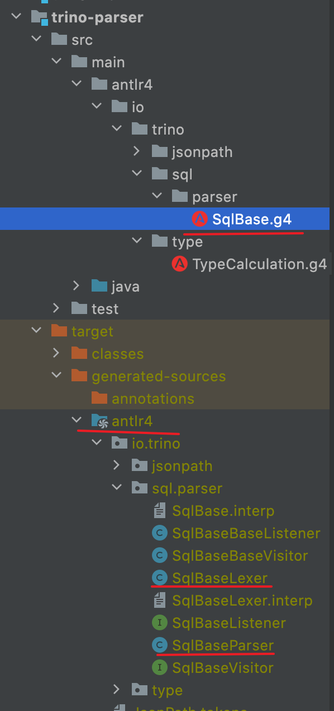

抽象语法树（AST，**是在生成语法分析树后，再对语法分析树进行visit生成的**）是用一种树形结构（即我们在大学数据结构与算法课程中学过的树）来表示SQL想要表述的语义，将一段SQL字符串结构化，以支持SQL执行引擎根据AST生成SQL执行计划。在Presto中，Node表示树的节点的抽象。根据语义不同，SQL AST中有多种不同类型的节点，它们继承自Node节点，如下所示：

> [antlr学习链接](https://mp.weixin.qq.com/s?__biz=MzI4NjY4MTU5Nw==&mid=2247491631&idx=2&sn=d70dd5119f456986a9a7939914cc0f98&chksm=ebdb90bddcac19ab0523b46f6b82361eda6858063d42b4ada781bd449a08c9fba6b92c78d23e&scene=21#wechat_redirect)
>
> [antlr教程](https://wizardforcel.gitbooks.io/antlr4-short-course/content/calculator-visitor.html)

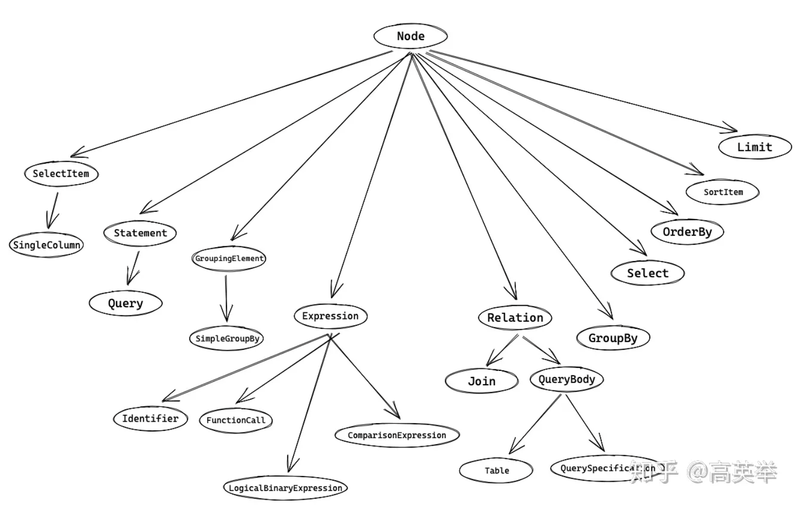

对于第一步中接收到的SQL(TPC-DS Query55)，我们来看一下它对应的AST长什么样？（细节比较多，请一定要点击图片看大图）

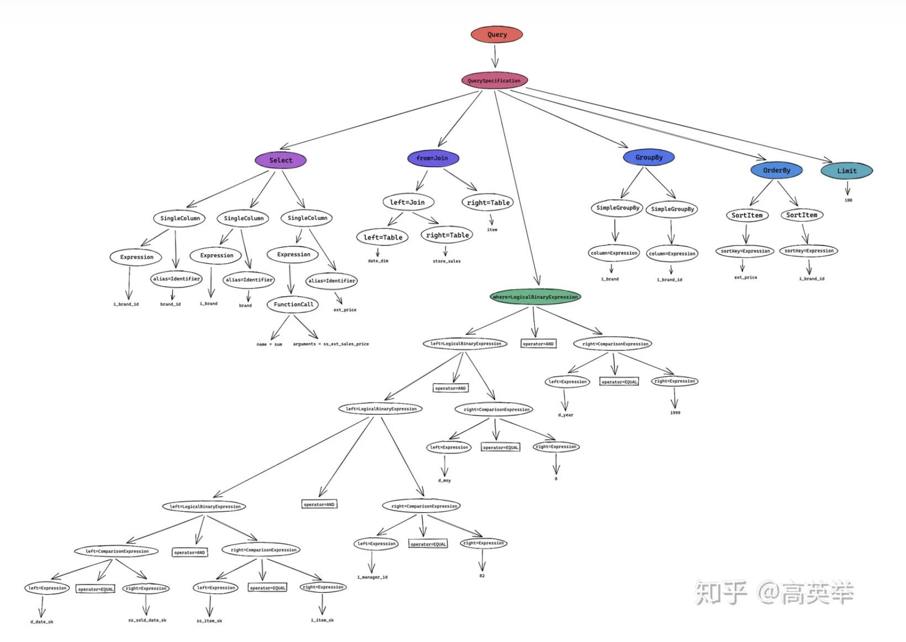

**这一步，我们可以拿到一个用户Statement来表示的根的AST树，在后面我们将会使用它来生成执行计划。**

**上面这张图就是通过visit模式遍历语法分析tree生成的，语法分析tree如下图所示**

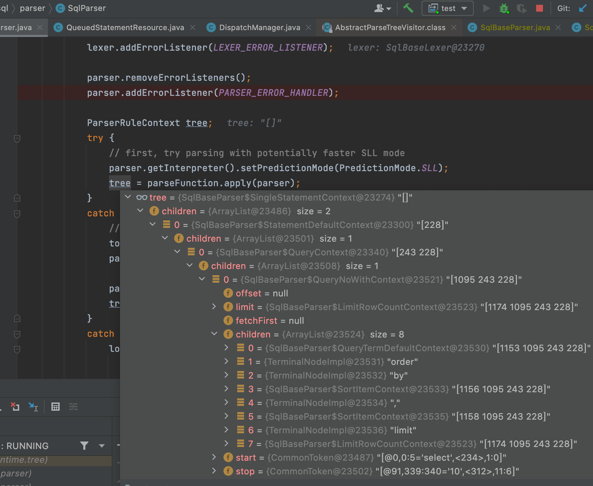

**继承Visitor类，对语法分析树进行visit来开发自己的业务逻辑代码，最终生成Statement来表示的根的AST。如下图所示，就是visit结束后返回的结果，等同于上面的AST**

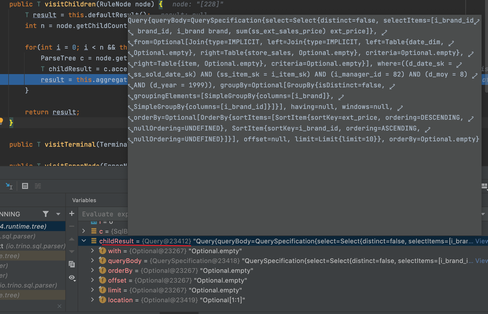


### 3.3 第三步：【Coordinator】创建QueryExecution并提交给ResourceGroupManager运行

在DispatchManager::createQueryInternal() 中的dispatchQueryFactory.createDispatchQuery()方法执行中，根据Statement的类型，生成QueryExecution。对于此文中我们举例的SQL，会生成SqlQueryExecution；对于Create Table这样的SQL，生成的是DataDefinitionExecution；

随后，这一步中生成的QueryExecution被包装到LocalDispatchQuery中，提交给ResourceGroupManager等待运行：

```java
// File: DispatchManager.java
// package: io.trino.dispatcher
// Method: createQueryInternal()
resourceGroupManager.submit(dispatchQuery, selectionContext, dispatchExecutor);
```

**之后在submit()中，经过一系列的异步操作（各种Future），代码辗转执行到了SqlQueryExecution::start()方法，此方法串起来了执行计划的生成以及调度。接下来看下怎么执行到SqlQueryExecution::start()方法中**

首先是通过线程池调用了如图所示方法栈:

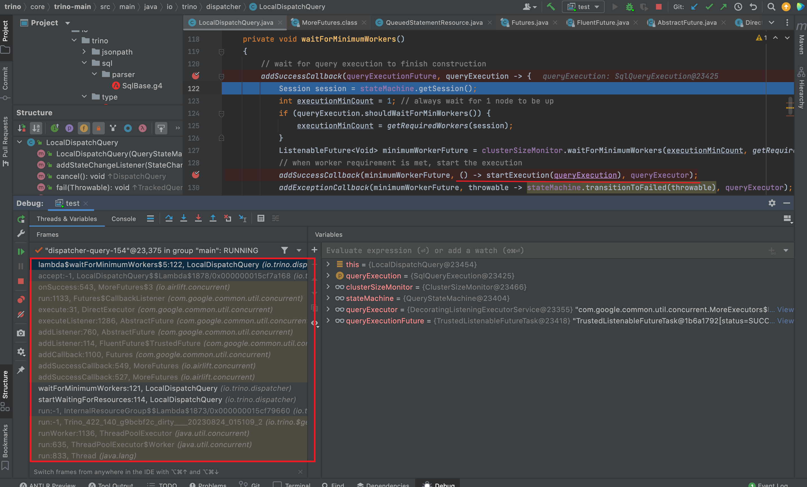

在waitForMinimumWorkers()方法中，通过调用`io.airlift.concurrent.MoreFutures.addSuccessCallback`方法异步执行lambda表达式（**addSuccessCallback方法的调用链具体可见上图所示**）。然后在lambda表达式中再通过addSuccessCallback方法执行` () -> startExecution(queryExecution), queryExecutor`，在startExecution(queryExecution)中最终会执行到SqlQueryExecution::start()方法，如下图所示：

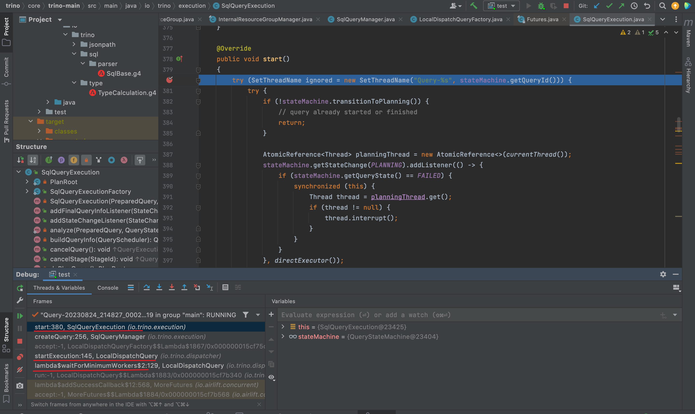

```java
// File: SqlQueryExecution.java
// package: io.trino.execution
// Method: start()

// 介绍：这里只节选了最核心的代码
public void start()
{
    ...
    // 生成logical plan，此方法进一步调用了doPlanQuery()
    PlanRoot plan = planQuery();
    // 生成数据源Connector的Connector，创建SqlStageExecution（Stage）、指定StageScheduler
  	registerDynamicFilteringQuery(plan);	 
    planDistribution(plan);
    ...
    QueryScheduler scheduler = queryScheduler.get();
    // Stage的调度，根据执行计划，将Task调度到Presto Worker上
    scheduler.start();
    ...
}
```


### **3.4 第四步：【Coordinator】语义分析(Analysis)、生成执行计划LogicalPlan**

接下来要讲的第四步、第五步、第六步，他们的执行流程都体现在了SqlQueryExecution::doPlanQuery()中，代码如下：

```java
// File: SqlQueryExecution.java
// package: io.trino.execution
// Method: doPlanQuery()

// 介绍：这里只节选了最核心的代码
private PlanRoot doPlanQuery()
{
    PlanNodeIdAllocator idAllocator = new PlanNodeIdAllocator();
    LogicalPlanner logicalPlanner = new LogicalPlanner(..., idAllocator, ...);
    // 第四步：【Coordinator】语义分析(Analysis)、生成执行计划LogicalPlan
    // 第五步：【Coordinator】优化执行计划，生成Optimized Logical Plan
    Plan plan = logicalPlanner.plan(analysis);

    ...

    // 第六步：【Coordinator】为逻辑执行计划分段(Fragment)
    SubPlan fragmentedPlan = planFragmenter.createSubPlans(..., plan, ...);

   ...
   return new PlanRoot(fragmentedPlan, !explainAnalyze);
}
```

关注一下上面代码，我们先预告一下LogicalPlanner::plan()的职责：

- 语义分析(Analysis)：遍历SQL AST，将AST中表达的含义，拆解为多个Map结构以便后续生成执行计划时，不再频繁需要遍历SQL AST。同时还去获取了表和字段的元数据，生成了对应的ConnectorTableHandle, ColumnHandle等与数据源Connector相关的对象实例，也是为了之后拿来即用。在此过程中生成的所有对象，都维护在一个实例化的Analysis对象中，你可以把它理解为是一个Context对象。（如果还是不明白Analysis是什么意思，可以直接看看Analysis.java的源码）
- 生成执行计划LogicalPlan：生成以PlanNode为节点的逻辑执行计划，它也是类似于AST那样的树形结构，树节点和根的类型都是PlanNode。其实在Presto代码中，并没有任何一段代码将PlanNode树称之为逻辑执行计划（LogicalPlan），但是由于负责生成PlanNode树的类名称是LogicalPlanner，所以我们也称之为逻辑执行计划（LogicalPlan），此PlanNode树的实际作用，也与其他SQL执行引擎的逻辑执行计划完全相同。
- 优化执行计划，生成Optimized Logical Plan：用预定义的几百个优化器迭代优化之前生成的PlanNode树，并返回优化后的PlanNode树。后面小节再详细介绍。

LogicalPlanner::plan()的代码实现如下：

```java
// File: LogicalPlanner.java
// package: io.trino.sql.planner
// Method: plan()

// 介绍：这里只节选了最核心的代码
public Plan plan(Analysis analysis, Stage stage, boolean collectPlanStatistics)
{
    // 第四步：【Coordinator】语义分析(Analysis)、生成执行计划LogicalPlan
    PlanNode root = planStatement(analysis, analysis.getStatement());

    ...
    // 第五步：【Coordinator】优化执行计划，生成Optimized Logical Plan
    for (PlanOptimizer optimizer : planOptimizers) {
        root = optimizer.optimize(root, session, symbolAllocator.getTypes(), symbolAllocator, idAllocator, warningCollector);
    }

    ...
    return new Plan(root, ...);
}
```

> 生成逻辑计划主要还是由RelationPlanner进行visit访问，但是因为语义分析已经将AST用Map进行保存，所以就在visit时就可直接从analysis中获取

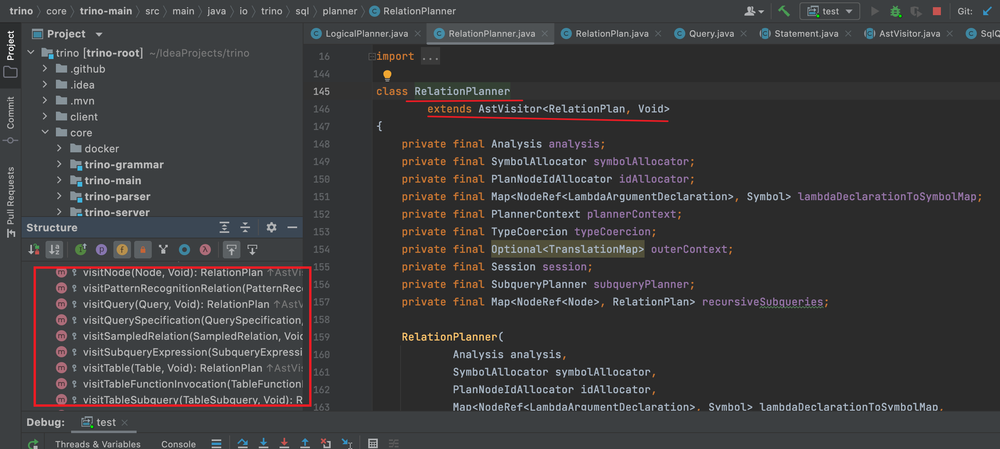

这里我们重点关注的是：PlanNode树长什么样？

首先PlanNode也是类似Node那样是一个abstract class，有多个其他的PlanNode类型继承自PlanNode，是多层父子类继承结构，如下：

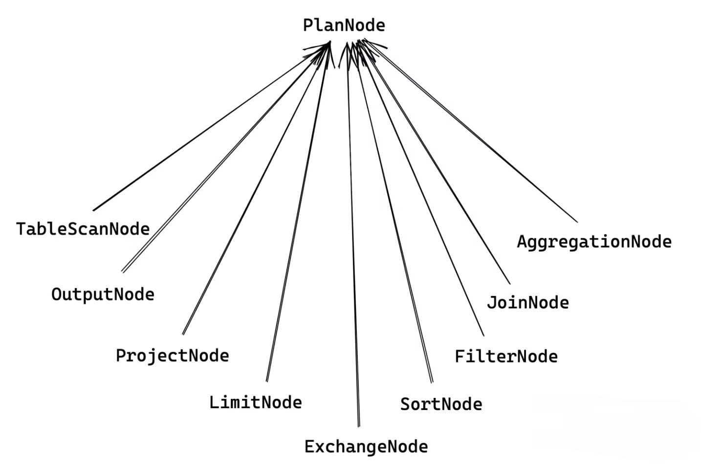

对于TCP-DS Query55（见上面第一步Presto接收到的SQL），它对应的逻辑执行计划树是下图所示，还没有优化过：

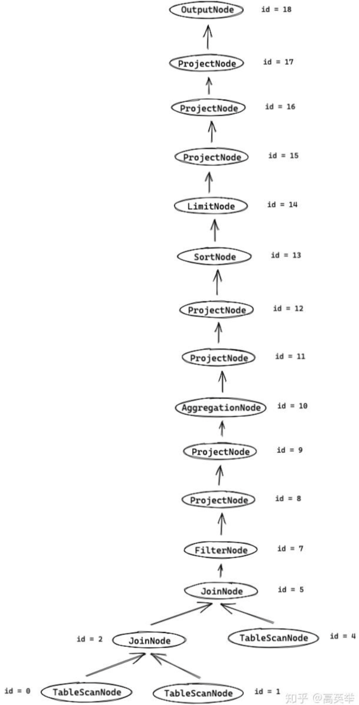

**下图展示的正是源码中逻辑计划，与上图一样**

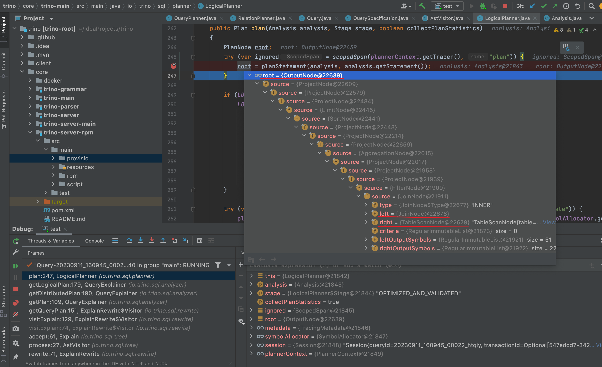

> 注意，此时未经过优化的逻辑计划中，TableScanNode输出的是所有的列，但是经过优化后的逻辑计划中TableScanNode的输出是根据sql查询需要的列，如下图所示

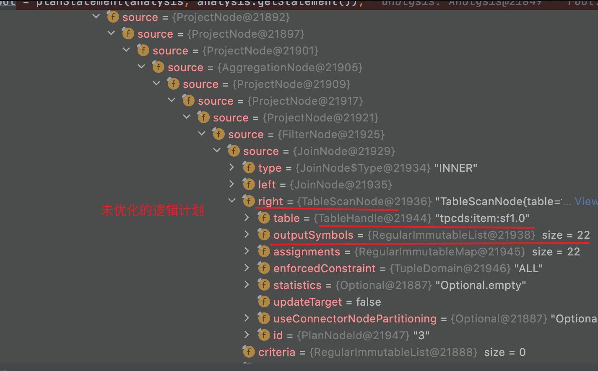

**优化后的**

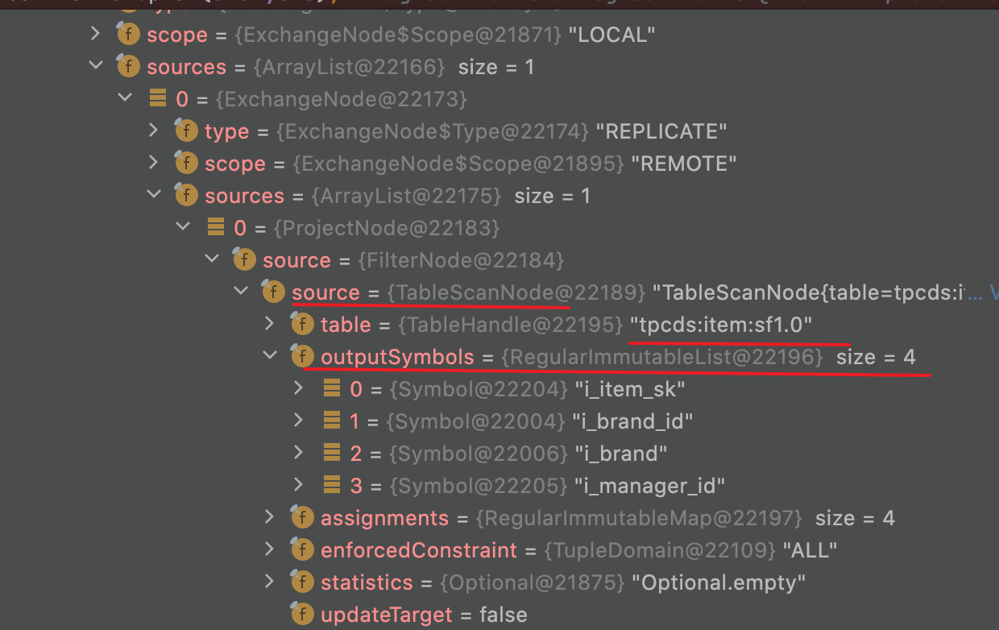

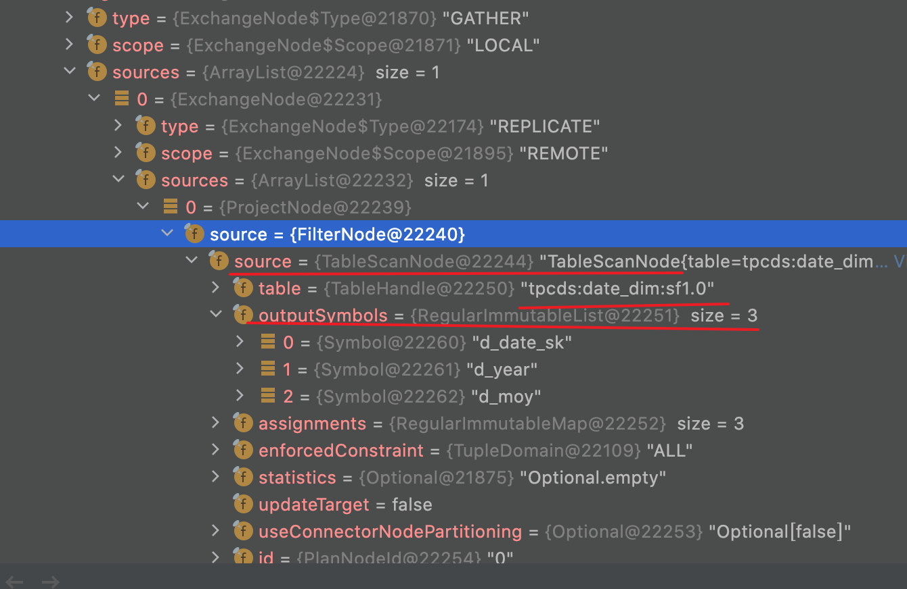

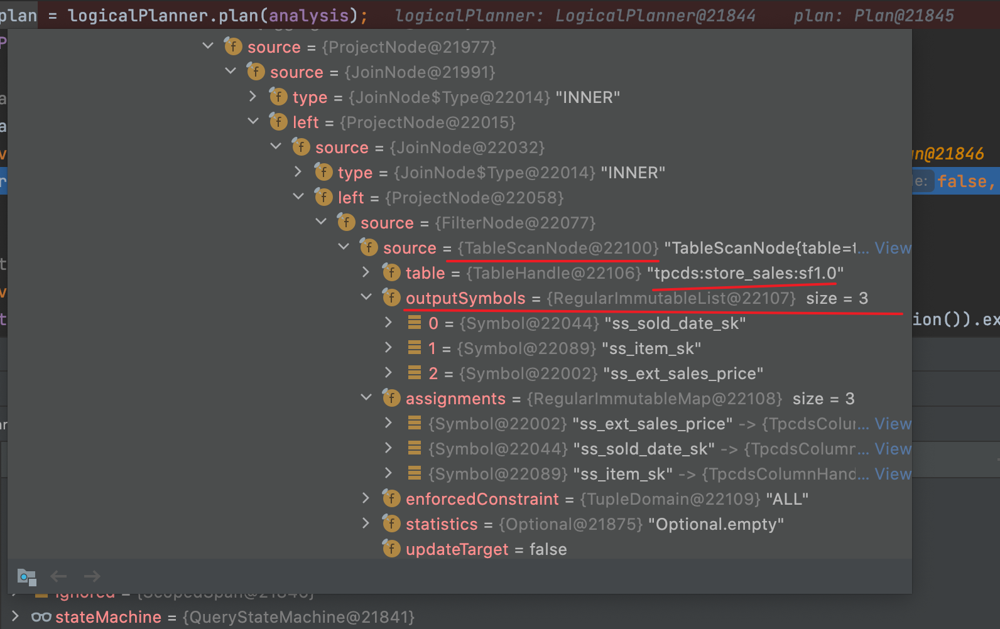


## **3.5 第五步：【Coordinator】优化执行计划，生成Optimized Logical Plan**

上一步生成的逻辑执行计划，如果直接去执行，可能执行效率不是最优的，Presto的执行计划生成过程，还有一个优化执行计划的过程，在这个过程中，它会以RBO和CBO的方式用系统中已有的优化器来完成执行计划的优化。RBO指的是基于规则的优化（Rule Based Optimization），如：将Filter下退，在SCAN表的时候完成数据的过滤。CBO指的是基于成本的优化（Cost Based Optimization），如：有多个表的Join时，需要根据表的大小来选择Join的顺序以优化执行效率，基于成本优化，需要收集大量的统计信息才能够做出决策，从这一点上来说，CBO比RBO要复杂很多。

Presto的优化器（Optimizer）有多种，它们都实现了PlanOptimizer的接口，从PlanOptimizers的构造函数中，可以看到Presto启动时，都初始化了哪些PlanOptimizer：

```java
public interface PlanOptimizer {
    PlanNode optimize(
            PlanNode plan,
            Session session,
            TypeProvider types,
            SymbolAllocator symbolAllocator,
            PlanNodeIdAllocator idAllocator,
            WarningCollector warningCollector);
}
```

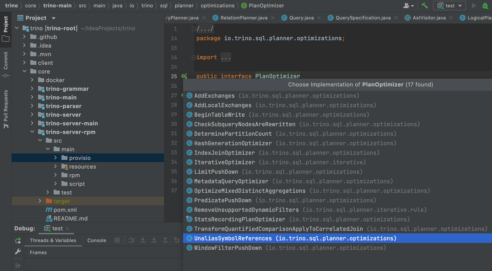

对于TCP-DS Query55（见上面第一步Presto接收到的SQL），它对应的优化后的逻辑执行计划树如下图所示

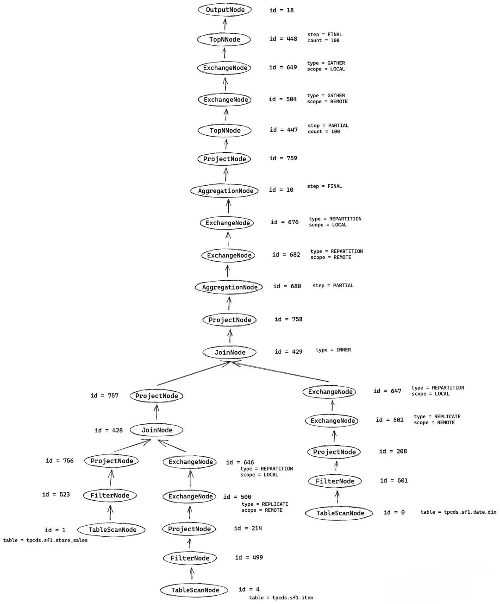


## **3.6 第六步：【Coordinator】为逻辑执行计划分段(PlanFragment)**

优化完执行计划后，紧接着下一步就是为逻辑执行计划（PlanNode树）分段（划分PlanFragment），生成SubPlan，我们再回看一下SqlQueryExecution::doPlanQuery()的代码：

```java
// File: SqlQueryExecution.java
// package: io.trino.execution
// Method: doPlanQuery()

// 介绍：这里只节选了最核心的代码
private PlanRoot doPlanQuery() {
    PlanNodeIdAllocator idAllocator = new PlanNodeIdAllocator();
    LogicalPlanner logicalPlanner = new LogicalPlanner(..., idAllocator, ...);
    // 第四步：【Coordinator】语义分析(Analysis)、生成执行计划LogicalPlan
    // 第五步：【Coordinator】优化执行计划，生成Optimized Logical Plan
    Plan plan = logicalPlanner.plan(analysis);

    ...

    // 第六步：【Coordinator】为逻辑执行计划分段(Fragment)[也被称之为划分Stage]
    SubPlan fragmentedPlan = planFragmenter.createSubPlans(..., plan, ...);

   ...
   return new PlanRoot(fragmentedPlan, ..., extractTableHandles(analysis));
}
```

划分Fragment生成SubPlan的逻辑，是用SimplePlanRewriter的实现类Fragmenter遍历上一步生成的PlanNode树，对于每组相邻的两个ExchangeNode，将其靠近叶子节点侧的ExchangeNode替换为RemoteSourceNode，并且断开靠近叶子节点侧的连接，这样一个PlanNode树就被划分成了两个PlanNode树，一个Parent（对应创建一个PlanFragment），一个Child（又称之为SubPlan，对应创建一个PlanFragment）。

遍历完整个PlanNode树，我们就得到了若干个PlanFragment，对于TPC-DS Query55的例子来说，这一步将生成5个PlanFragment（编号从0到4）。在后面的流程中，Presto会继续根据这些PlanFragment来创建StageExecution（就是我们常说的Presto执行模型中的Stage），简单来说，PlanFragment与StageExecution是一一对应的。StageExecution负责生成的Task在任务调度时，会被分发到Presto Worker上执行。这些Task执行的是什么逻辑？这个就是由Task所属的StageExecution对应PlanFragment中的执行计划(PlanNode树）决定的。

只是文字描述还是太抽象，我们直接看上一步生成的执行计划划分完PlanFragment之后的样子，如下图所示（图画的丑了点）：

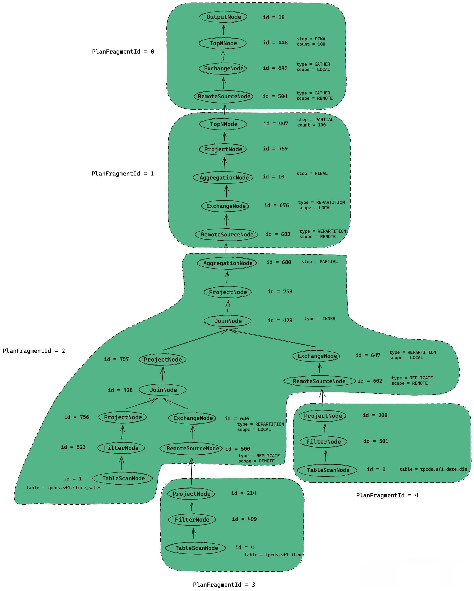


## **3.7 第七步：【Coordinator】创建SqlStageExecution（创建Stage）**

在Presto的执行模型中，SQL的执行被划分为几个层次，分别是：

- Query：用户提交的一个SQL，触发的Presto的一次查询，就是一个Query，在代码中对应一个QueryInfo。每个Query都有一个字符串形式的QueryId，举例：20201029_082835_00003_nus9b
- Stage：Presto生成Query的执行计划时，根据是否需要做跨Worker节点的数据交换来划分Fragment，调度执行计划时，每个Fragment对应一个Stage，在代码中对应一个StageInfo，其中有StageId，StageId = QueryId + "." + 一个数字id。某个Query中最小的StageId是0，最大的StageId是此Query中所有Stage个数减一。Stage之间是有数据依赖关系的是不能并行执行的，存在执行上的顺序关系，需要注意的是StageId越小，这个Stage的执行顺序越靠后。Presto的Stage可以类比于Spark的Stage概念，它们的不同是Presto不像Spark批式处理那样，需要前面的Stage执行完再执行后面的Stage，Presto是流水线（pipeline）的处理机制。StageId举例：20201029_082835_00003_nus9b.0
- Task：Task是Presto分布式任务的执行单元，某个Stage可以有多个Task，这些Task可以并行执行，同一个Stage中的所有Task的执行逻辑完全相同。某个Stage的Task个数就是此Stage的并发度，在Presto的任务调度代码中，我们可以看到Task的个数是根据Stage的类型（Source、Fixed、Single）以及Worker的个数来决定的。TaskId = QueryId + "." + StageId + "." + 一个数字id，举例：20201029_082835_00003_nus9b.0.3

如下图所示，我们执行了TPC-DS Query55（见第一步中接收到的SQL），从Presto WebUI上扒下来了它的完成优化并且划分了Stage后的执行计划（点击看大图），这个执行计划树的结构与我们上一步看到的优化后的执行计划树是一样的，只是根据ExchangeNode拆分了5个Stage（同时这个5个Stage与前面地六步说的PlanFragment一一对应）：

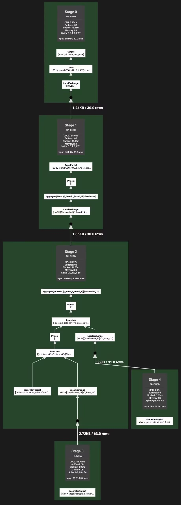

在这一步，Presto要做的事情是创建SqlStageExecution（俗称Stage），我们在前面说过，Stage与PlanFragment是一一对应的。这里只是创建Stage，但是不会去调度执行它，这个动作在后面的流程再详细介绍。

让我们继续回看SqlQueryExecution::start()方法，此方法串起来了执行计划的生成以及调度，我们在第三步介绍过，上面详细介绍了第四步到第六步所做的工作，它们都被包装在SqlQueryExecution::planQuery()中，这个函数执行完后将继续执行后面的SqlQueryExecution::planDistribution()方法，代码如下：

```java
// File: SqlQueryExecution.java
// package: io.trino.execution
// Method: start()

// 介绍：这里只节选了最核心的代码
public void start() {
    ...
    // 生成logical plan，此方法进一步调用了doPlanQuery()
    PlanRoot plan = planQuery();
    // 生成数据源Connector的Connector，创建SqlStageExecution（Stage）、指定StageScheduler
    planDistribution(plan);
    SqlQueryScheduler scheduler = queryScheduler.get();
    // Stage的调度，根据执行计划，将Task调度到Presto Worker上
    scheduler.start();
    ...
}
```

可以说，前面的几个执行步骤已经够复杂了，脑回路都不够用了。但是不得不说，后面要介绍的planDistribution()也很复杂。整篇文章需要很强大的意志力才能消化掉，大部分人估计还没看到这里就放弃了^_^，所以你一定要加油哦。

我们还是回到正题，planDistribution()这个方法做了什么呢？

```java
// File: SqlQueryExecution.java
// package: io.trino.execution
// Method: planDistribution()

private void planDistribution(PlanRoot plan) {
    // plan the execution on the active nodes
    DistributedExecutionPlanner distributedPlanner = new DistributedExecutionPlanner(splitManager, metadata);
    // 遍历执行计划PlanNode树，找到所有的TableScanNode（也就是Connector数据源对应的PlanNode），获取到它们的ConnectorSplit。
    StageExecutionPlan outputStageExecutionPlan = distributedPlanner.plan(plan.getRoot(), stateMachine.getSession());

    ...
    // if query was canceled, skip creating scheduler
    if (stateMachine.isDone()) {
        return;
    }

    ...
    // 创建最后一个Stage的OutputBuffer（代码叫Root，因为最后一个Stage其实就是在执行计划树的树根），这个OutputBuffer用于给Presto SQL客户端输出Query的最终计算结果。
    PartitioningHandle partitioningHandle = plan.getRoot().getFragment().getPartitioningScheme().getPartitioning().getHandle();
    OutputBuffers rootOutputBuffers = createInitialEmptyOutputBuffers(partitioningHandle)
            .withBuffer(OUTPUT_BUFFER_ID, BROADCAST_PARTITION_ID)
            .withNoMoreBufferIds();
  // 创建SqlStageExecution（俗称Stage），被包装在SqlQueryScheduler里面返回，我们在前面说过，Stage与PlanFragment是一一对应的。这里只是创建Stage，但是不会去调度执行它，这个动作在后面。
    SqlQueryScheduler scheduler = createSqlQueryScheduler(
            stateMachine,
            locationFactory,
            outputStageExecutionPlan,
            nodePartitioningManager,
            nodeScheduler,
            remoteTaskFactory,
            stateMachine.getSession(),
            plan.isSummarizeTaskInfos(),
            scheduleSplitBatchSize,
            queryExecutor,
            schedulerExecutor,
            failureDetector,
            rootOutputBuffers,
            nodeTaskMap,
            executionPolicy,
            schedulerStats);

    queryScheduler.set(scheduler);
}
```

**planDistribution()的主要逻辑就两个：**

一个是从数据源Connector中获取到所有的Split。Split是什么呢？你可以理解为它是你要从数据源获取的数据分片，这是Presto中分块组织数据的方式，Presto Connector会将待处理的所有数据划分为若干分片让Presto读取，而这些分片也会被安排到（assign）到多个Presto Worker上来处理以实现分布式高性能计算。这里我又要提到Flink了，因为我还是怀疑Flink是大量借鉴了Presto源码的，Flink里面也有Split的概念，与Presto的Split类似。

由于本篇文章使用的是TPC-DS Query55这个SQL，它虽然是一个有JOIN的SQL，但是所有的表（store_sales, item, date_dim）都来自于tpcds这个connector，我们这里并没有用到Presto最擅长的跨connector联邦查询，所有的Split都是从tpcds connector的代码实现中生成的，因为是具体的Connector插件而不是Presto，决定了Split的生成逻辑，这个涉及到Presto的插件化机制，我们后面的章节再详细介绍吧，这里只简单说一下Split有哪些基本信息：

```java
// File: ConnectorSplit.java
// package: io.trino.spi.connector
// Class: ConnectorSplit

public interface ConnectorSplit {
    // 这个信息定义了Split可以从哪些节点访问到（这些节点，并不需要是Presto集群的节点，例如对于计算存储分离的情况，大概率Presto的节点与数据源Split所在的节点不是相同的）
    List<HostAddress> getAddresses();
    // 这个信息定义了Split是否可以从非Split所在的节点访问到。对于计算存储分离的情况，这里需要返回true。
    boolean isRemotelyAccessible();   
    // 这里允许Connector设置一些自己的信息
    Object getInfo();
}
```

特别注意下，这一步只是生成数据源的Split，但是既不会把Split安排到某个Presto Worker上，也不会去真正的使用Split读取Connector的数据。感兴趣的朋友，可以翻一下SplitManager::getSplits()与ConnectorSplitManager::getSplit()的源码

另一是createSqlQueryScheduler()会为执行计划的每一个PlanFragment创建一个SqlStageExecution。每个SqlStageExecution（Stage）对应一个StageScheduler，不同分区类型(PartitioningHandle)的Stage PlanFragment对应不同类型的StageScheduler，后面在调度Stage时，主要依赖的是这个StageScheduler的实现。

创建完SqlStageExecution后，会被包装在新创建的SqlQueryScheduler对象中返回，紧接着就是去调度Stage、创建Task，分发到Presto集群的Worker上去执行，我们会在下一步展开介绍。


## **3.8 第八步：【Coordinator】Stage调度-生成HttpRemoteTask并分发到Presto Worker**

让我们继续回看SqlQueryExecution::start()方法，此方法串起来了执行计划的生成以及调度，代码及注释如下：

```java
// File: SqlQueryExecution.java
// package: io.trino.execution
// Method: start()

// 介绍：这里只节选了最核心的代码
public void start() {
    ...
    // 生成logical plan，此方法进一步调用了doPlanQuery()
    PlanRoot plan = planQuery();
    // 生成数据源Connector的Connector，创建SqlStageExecution（Stage）、指定StageScheduler
    planDistribution(plan);
    SqlQueryScheduler scheduler = queryScheduler.get();
    // Stage的调度，根据执行计划，将Task调度到Presto Worker上
    scheduler.start();
    ...
}
```

在这一步，我们要重点介绍的是生成了Query的所有Stage后，如何再继续生成这些Stage的Task，再将这些Task调度到对应的Presto Worker上去执行计算任务，也就是上面代码的最后一个逻辑：scheduler.start()。这个方法实际调用了SqlQueryScheduler::schedule()方法，如下代码所示：

```java
// File: SqlQueryScheduler.java
// package: io.trino.execution.scheduler
// Method: schedule()
// Description: 这个方法其实行数很多，但是经过我们简化后，核心的逻辑就这么几行，如果你看源码的时候，感觉太复杂，那么我们就看这几行就好。

private void schedule() {

    ...
    // 根据执行策略确定Stage的调度顺序与调度时机，默认是AllAtOnceExecutionPolicy会按照Stage执行的上下游关系依次调度Stage，生成Task并全部分发到Presto Worker上。另外一种策略是PhasedExecutionPolicy，感兴趣的朋友可以翻看一下相关源码。
    ExecutionSchedule executionSchedule = executionPolicy.createExecutionSchedule(stages.values());
    for (SqlStageExecution stage : executionSchedule.getStagesToSchedule()) {

        // 拿到当前Stage对应的StageScheduler
        StageScheduler stageScheduler = stageSchedulers.get(stage.getStageId())
        // 绑定Presto Worker（Node）与上游数据源Split的关系、创建Task并调度到Presto Worker上
        ScheduleResult result = stageScheduler.schedule();
        // 将上一步在当前Stage上刚创建的Task，注册到下游Sage的sourceTask列表里
        stageLinkages.get(stage.getStageId())
            .processScheduleResults(stage.getState(), result.getNewTasks());
        ...
    }
}
```

总结下来，对于Query的每个Stage，就干了三件事：

- Get StageScheduler：拿到当前Stage对应的StageScheduler
- Schedule Split & Task：绑定Presto Worker（Node）与上游数据源Split的关系、创建Task并调度到Presto Worker上
- Add ExchangeLocation：将上一步在当前Stage上刚创建的Task，注册到下游Sage的sourceTask列表里

对于本文举例的TPC-DS Query55 SQL来说，上面的代码翻译成流程图就是：

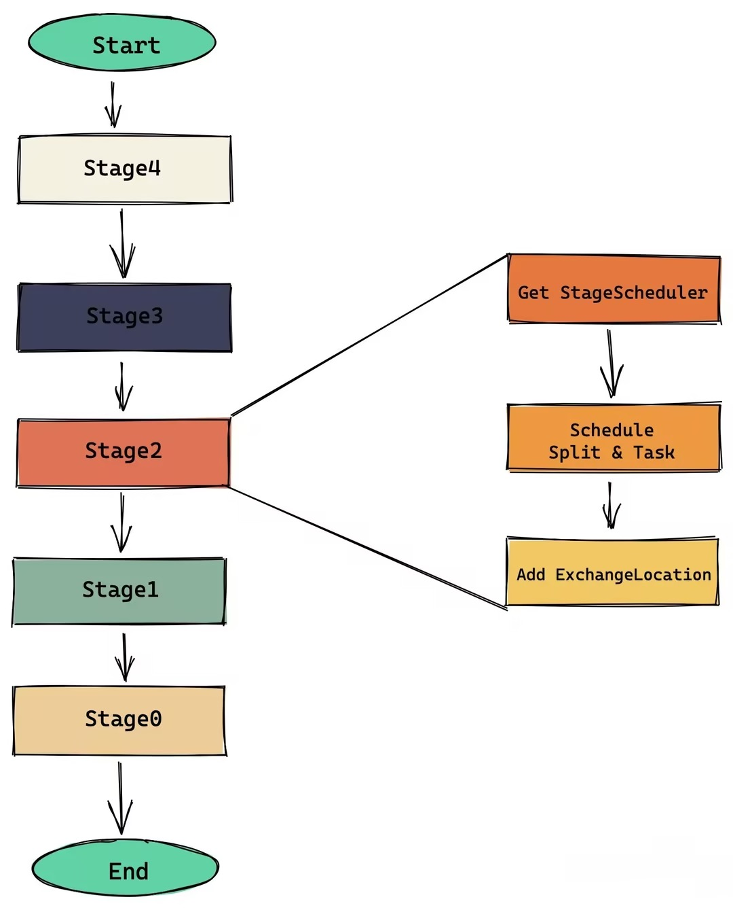

接下来我们分别介绍一下这三件事具体是什么：

**3.8.1 Get StageScheduler：拿到当前Stage对应的StageScheduler**

前面已经提到过每个SqlStageExecution（Stage）对应一个StageScheduler，不同分区类型(PartitioningHandle)的Stage PlanFragment对应不同类型的StageScheduler，后面在调度Stage时，主要依赖的是这个StageScheduler的实现。SqlQueryScheduler中通过Map<StageId, StageScheduler> stageSchedulers这样的一个数据结构维护了当前Query所有Stage的StageScheduler，所以这里我们需要先拿到当前Stage对应的StageScheduler。

StageScheduler是一个Java Interface，定义如下：

```java
// File: StageScheduler.java
// package: io.trino.execution.scheduler
// Interface: StageScheduler
// Description: 

public interface StageScheduler extends Closeable {

    ScheduleResult schedule();

    @Override
    default void close() {}
}
```

到目前为止StageScheduler有4个实现类，分别对应了4种不同的Stage调度方式，如下图所示，最常用到的是SourcePartitionedScheduler与FixedCountScheduler，本文暂时也只会介绍这两个StageScheduler。

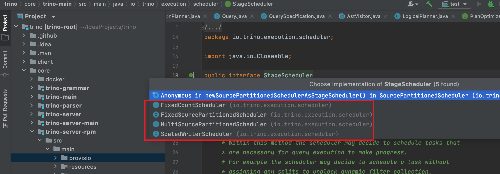

**3.8.2 Schedule Split & Task：绑定Presto Worker（Node）与上游数据源Split的关系、创建Task并调度到Presto Worker上**

StageScheduler的职责是绑定Presto Worker（Node）与上游数据源Split的关系、创建Task并调度到Presto Worker上。在本文的SQL举例TPC-DS Query55中，5个StageScheduler，只用到了其中的两个SourcePartitionedScheduler与FixedCountScheduler，接下来会详细介绍一下。如下图我们在IDEA中debug时的截图：

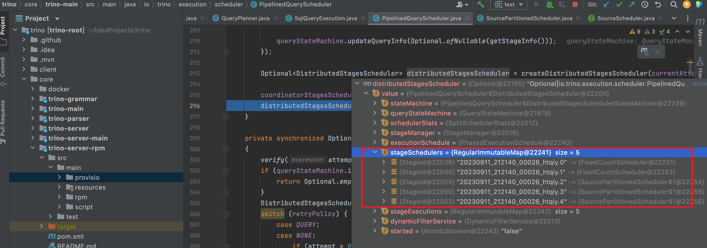

**3.8.2.1 StageId = 2、3、4，对应的是SourcePartitionedScheduler**

Stage4、Stage3、Stage2的上游数据源由于都有数据源Connector，这些Stage的Task调度使用的是SourcePartitionedScheduler。这种StageScheduler的实现代码还挺复杂的，仅代码量就比FixedCountScheduler多很多。我们先尝试用简单的描述性文字来总结一下它的执行流程：

首先，从数据源connector那里获取一批Split（get next split batch），准备去先调度这些Split。Presto的默认配置每批最多调度1000个Split。FixedSplitSource 预先准备好所有的Split，Presto框架的SplitSource::getNextBatch()每次会根据需要获取一批Split，FixedSplitSource根据需要的个数来返回。几乎所有的Connector都是用的这个，只有少数几个Connector如Hive实现了自己的ConnectorSplitSource。

其次，根据SplitPlacementPolicy为这一批Split挑选每个Split对应的节点（Calculate placements on Presto Worker Node for splits）。这里的挑选，指的是建立一个Map，key是节点，value是Split列表。SplitPlacementPolicy如何为Split挑选节点？这个问题有点难以用简单的语言描述，我们会在后续发布的文章中详细介绍，期待一下吧。

最后，生成Task并调度到Presto Worker上（Schedule split on specific node, create and schedule task first if no task found on specific node）。Task的调度需要先绑定Node与Split的关系，再绑定Split与Task的关系，再将Task shedule到Node上。Split选择了哪些node，哪些node就会创建Task。split的选择了多少node，就会有多少个node创建Task，这个影响到了Stage并行度。如果某个Stage在某个node上有要处理的split，那么这个node上至少要schedule一个Task才行的，Task是split处理的最小执行单位，不同的Stage之间的Task是不可以共用的，主要是因为不同的Stage的执行逻辑不一样，这个从执行计划中就可以联想到。

生成Task即创建HttpRemoteTask实例，绑定分配到当前节点的Split，之后调用HttpRemoteTask::start()将任务分发到Presto Worker上。下面的代码SqlStageExecution::scheduleTask()详细描述了这个过程。这个分发的过程，说起来其实也比较简单，其实就是构造一个携带了PlanFragment和Split信息的Http Post请求，请求对应Presto Worker的URI：/v1/task/{taskId} ，Presto Worker在收到请求后，会解析PlanFragment中的执行计划并创建SqlTaskExecution，开始执行任务，我们会在下一步详细介绍Presto Worker是怎么执行任务的。

```java
// File: SqlStageExecution.java
// package: io.prestosql.execution
// method: SqlStageExecution::scheduleTask
// Description: Task的生成和调度都会走到这个方法，代码已经过精简，去掉了非核心逻辑

private synchronized RemoteTask scheduleTask(InternalNode node, TaskId taskId, Multimap<PlanNodeId, Split> sourceSplits, OptionalInt totalPartitions) {
    
    ImmutableMultimap.Builder<PlanNodeId, Split> initialSplits = ImmutableMultimap.builder();
    // 添加来自上游数据源Connector的Split
    initialSplits.putAll(sourceSplits);

    // 添加来自上游Stage的Task的数据输出，注册为RemoteSplit
    sourceTasks.forEach((planNodeId, task) -> {
        TaskStatus status = task.getTaskStatus();
        if (status.getState() != TaskState.FINISHED) {
            initialSplits.put(planNodeId, createRemoteSplitFor(taskId, status.getSelf()));
        }
    });

    // 创建HttpRemoteTask
    RemoteTask task = remoteTaskFactory.createRemoteTask(
            stateMachine.getSession(),
            taskId,
                  node,
            stateMachine.getFragment(),
            initialSplits.build(),
            totalPartitions,
            this.outputBuffers.get(),
            nodeTaskMap.createPartitionedSplitCountTracker(node, taskId),
            summarizeTaskInfo);

    // 将刚创建的TaskId添加到当前Stage的TaskId列表中
    allTasks.add(taskId);
    // 将刚创建的Task添加到当前Stage的节点与Task映射的map中
    tasks.computeIfAbsent(node, key -> newConcurrentHashSet()).add(task);
    nodeTaskMap.addTask(node, task);

    if (!stateMachine.getState().isDone()) {
        // 向Presto Worker发请求，把刚创建的Task调度起来，开始执行
        task.start();
    }
    else {
        // stage finished while we were scheduling this task
        task.abort();
    }
    return task;
}
```

**3.8.2.2 StageId = 0、1， 对应的是FixedCountScheduler**

Stage0，Stage1的数据源只有上游Stage的Task输出，使用FixedCountScheduler在选中的节点上调度Task即可。这些Task在Presto Worker上执行时，将从上游Stage的Task OutputBuffer拉取数据计算结果。具体到实现上，FixedCountScheduler使用的是上面刚介绍过的SqlStageExecution::scheduleTask()，如下代码所示：

```java
// File: FixedCountScheduler.java
// package: io.prestosql.execution.scheduler
// class: FixedCountScheduler

public class FixedCountScheduler implements StageScheduler {
    // taskScheduler就是我们上面已经介绍过的SqlStageExecution::scheduleTask()方法。
    private final TaskScheduler taskScheduler;
    // Task将调度到下面的节点上（Presto Worker Node），每个节点对应一个Task
    private final List<InternalNode> partitionToNode;

    ...

    @Override
    public ScheduleResult schedule() {
        OptionalInt totalPartitions = OptionalInt.of(partitionToNode.size());
        List<RemoteTask> newTasks = IntStream.range(0, partitionToNode.size())
                .mapToObj(partition -> taskScheduler.scheduleTask(partitionToNode.get(partition), partition, totalPartitions))
                .filter(Optional::isPresent)
                .map(Optional::get)
                .collect(toImmutableList());

        return new ScheduleResult(true, newTasks, 0);
    }
}
```

有的朋友可能会有疑问，Presto如何选择在哪些节点上执行某个Stage的Task？这个逻辑与我们之前留下的另一个疑问——**Presto如何选择哪些节点来处理哪些数据源Connector的Split？**

**3.8.3 Add ExchangeLocation：将上一步在当前Stage上刚创建的Task，注册到下游Sage的sourceTask列表里，以建立数据交换关系**

某个Query的多个Stage之间由于是不同的Task在内存做数据计算，下游的Task必然需要拉取来自上游Task的计算结果。对于一个下游Stage的Task来说，它是怎么知道上游Task在哪里，上游Task的计算结果又输出到哪里了呢？这就需要构建一个Query所有Stage之间的数据链路（StageLinkage，这个概念在Presto的代码中也存在），上游Stage如果创建和调度了任务，它就需要告知下游Stage：“我在这些Presto Worker上创建了这些任务，你可以来拉取数据”，而下游Stage会回复：“好的，我会把这些Task作为我的SourceTask，在我去创建和调度Task时，会把这些SourceTask注册为RemoteSplit，通过Presto统一的数据交换体系来拉取你输出的数据”。整个过程如下图所示：

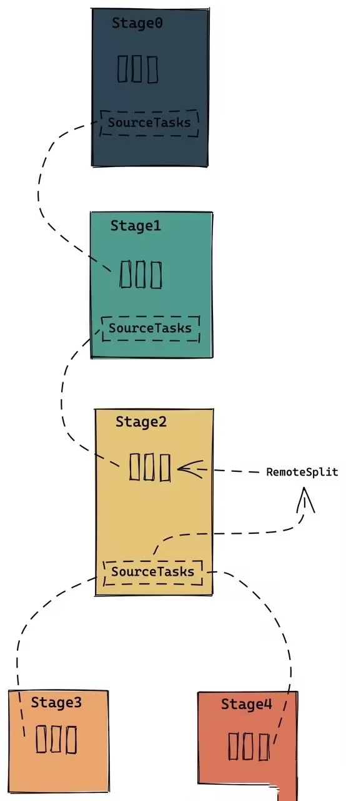

某个Stage的数据来源有两种，一种是数据源Connector，一种是上游Stage的Task输出到OutputBuffer的数据，对于下游的Stage来说，上游Stage的Task可以称之为source task。这些source task是通过SqlStageExecution::addExchangeLocations()注册到了下游SqlStageExecution中，让下游Stage知道了去哪里取数据。无论是哪一种数据源，Presto都统一抽象为了ConnectorSplit。当上游Stage作为数据源时，Presto把它看作是一种特殊的Connector，它的catalog name = $remote，其实就是个假的catalog，ConnectorSplit的实现类是RemoteSplit。

## **3.9 第九步：【Worker】在Presto Worker上执行任务，生成Query结果**

**3.9.1 什么是Volcano 执行模型？**

说起SQL执行引擎的任务执行模型，不得不提到一个大神Goetz Graefe，是他发明了Volcano执行模型（火山模型）。火山模型是数据库界已经很成熟的解释计算模型，该计算模型将关系代数中每一种操作抽象为一个 Operator，将整个 SQL 构建成一个 Operator 树，从根节点到叶子结点自上而下地递归调用 next() 函数。

例如 SQL：

```sql
SELECT Id, Name, Age, (Age - 30) * 50 AS BonusFROM PeopleWHERE Age > 30
```

对应火山模型如下：

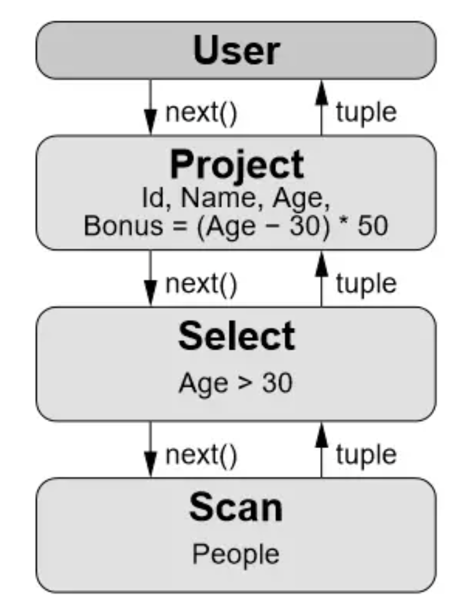

先来解释一下上图的含义：

- User：代表SQL客户端；
- Project Operator：垂直分割（投影），选择字段；
- Select（或 Filter）Operator：水平分割（选择)，用于过滤行，也称为谓词；
- Scan（TableScan）Operator：负责从数据源表中扫描数据。

这里包含了 3 个 Operator，首先 User 调用最上方的 Operator（Project）希望得到 next tuple，Project 调用子节点（Select），而 Select 又调用子节点（Scan），Scan 获得表中的 tuple 返回给 Select，Select 会检查是否满足过滤条件，如果满足则返回给 Project，如果不满足则请求 Scan 获取 next tuple。Project 会对每一个 tuple 选择需要的字段或者计算新字段并返回新的 tuple 给 User。如此往复，直到数据全部处理完。当 Scan 发现没有数据可以获取时，则返回一个结束标记告诉上游已结束。

为了更好地理解一个 Operator 中发生了什么，下面通过伪代码来理解 Select Operator：

```java
Tuple Select::next() {
    while (true) {
        Tuple candidate = child->next(); // 从子节点中获取 next tuple
        if (candidate == EndOfStream) // 是否得到结束标记
            return EndOfStream;
        if (condition->check(candidate)) // 是否满足过滤条件
            return candidate; // 返回 tuple
    }
}
```

Operator一般至少需要定义三个接口：

- open()：计算开始前，初始化Operator时需要用。
- next()：对于某个Operator，每调用一次它的next()，返回一条记录，代表此Operator的一个计算结果。
- close()：计算完成，销毁Operator时需要用。

可以看到，Volcano 模型是十分简单的，而且他对每个算子的接口都进行了一致性的封装。也就是说，从父节点来看，子节点具体是什么类型的算子并不重要，只需要能源源不断地从子节点的算子中 Fetch 到数据行就可以。这样的特性也给优化器从外部调整执行树而不改变计算结果创造了方便。

Operator链有简单的也有复杂的，如下图：

世界上大部分单机或分布式的数据库以及SQL执行引擎，都是这种Operator-Based 执行模型。Volcano执行模型诞生于20多年前，一个数据读取IO瓶颈更严重的时代，Vocalno模型虽然CPU不友好，也不要紧，现如今IO的性能有了较大提升，CPU的计算显得更加吃力一些，Volcano模型的问题就比较突出了。当然为了运行效率，现代的数据库或查询引擎是做过很多优化的，我们最常听到的几种优化是：

- 批量化（Batch Processing）：next()方法从每次只处理一条记录，改为处理多条，平摊了函数调用成本。
- 向量化执行（Vectorized Execution）：包含CPU的SIMD指令、循环loop unrolling，也包含列示存储和计算。这些底层的软件编码优化，大大提高了处理一批数据的性能。
- 代码生成（Code Generation）：Volcano的operator链在执行时，需要层层调用next()带来深层次的调用栈，在本篇最后参考资料的一篇中有提到，这种方式的效率还不如大学新生手写的代码。我们可以利用自动代码生成一个铺平的方法，去掉函数的调用，把层层调用的operator计算逻辑都安置在一起，经过数据实测，CPU能节省70%～90%的时间分片，去做更多真正有意义的计算逻辑。Apache Spark在这方面优化的比较狠，你可能听说过Whole Stage Code Generation，Spark先让开发者去调用各种算子完成计算逻辑，真正开始运行时，它会用Code Generation重新生成一些Stage的字节码。

**3.9.2 Presto Operator Based Execution Pipeline**

前面之所以要介绍Volcano执行模型，是因为Presto Worker的任务执行代码，能见到Volcano模型的Operator、Exchange，next这些概念，Presto也是一定程度上参考这个做的，算是给到了一些理论支撑。毕竟Presto没有提供相关设计文档，我们除了代码什么参考资料都没有，看看Volcano的论文多少能熟悉一点。但是Presto官方论文也说过，Presto的执行模型是“More than Volcano”，它做的事可能比Volcano更复杂。我们拿代码结合论文来讲一下，这里以TPC-DS Query55（SQL见第一步中的介绍）的Stage1中的任意Task的执行为例，如下图所示：

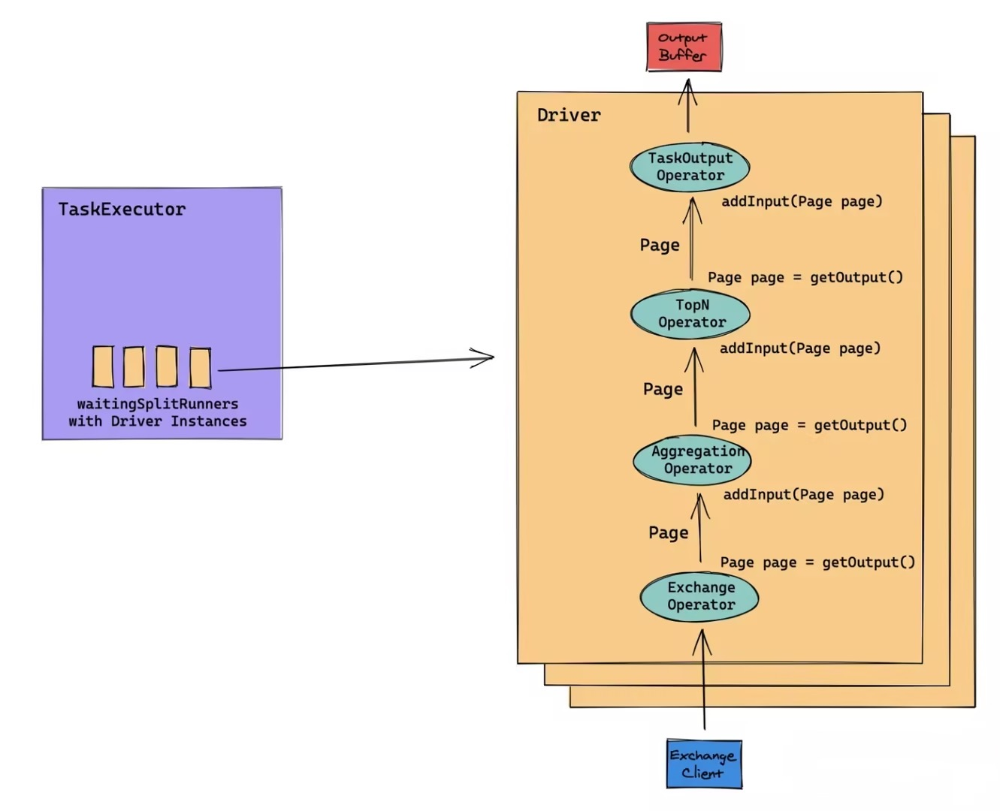

上图的含义是，Presto的Task执行流程是类似Volcano执行模型一样，首先根据执行计划，将多个operator串联起来。无论是来自数据源Connector的数据还是上游Stage输出的数据，从上游流入后，经过前面的operator处理再输出给后面的operator，最终输出到下游。

我们给出图中几个概念的解释：

1. Split：Split包含的信息可以让Presto Task知道去哪里拉取上游的数据，它是数据分区的基本单位（如果你愿意把它叫做partition也可以，就像Kafka那样）。上游数据源Connector的Split是ConnectorSplit，上游Stage的Split是RemoteSplit。RemoteSplit其实是ConnectorSplit接口的一个实现类，Presto在类似的逻辑上实现了高度的统一抽象。

\2. Operator：Presto代码中定义的Operator与Volcano执行模型的Operator含义是相同的。如下是Operator接口的定义，我们可以看到它与Volcano执行模型中给出的Operator基本类似：

- Operator初始化没有专门定义open()方法，因为每个Operator接口实现类的构造函数完全可以完成Operator的初始化。
- addInput(): 交给Operator一个数据的Page去处理，这个Page我们可以暂且理解为是一批待处理的数据。
- getOutput(): addInput()输入的数据，经过Operator的内部处理逻辑处理完后，通过getOutput()来输出，输出的数据类型仍然是Page。想知道这个Page是啥往下看。
- close()：Operator处理完数据后，负责流程控制的代码将调用close()销毁Operator、释放资源、清理现场。

```java
// File: Operator.java
// package: io.trino.operator
// Interface: Operator
// Description: Operator接口定义了很多方法，这里为了说明方便，我们只摘出来几个最重要的。

public interface Operator extends AutoCloseable {

    void addInput(Page page);

    Page getOutput();

    @Override
    default void close() throws Exception {}

    ...
}
```

Operator有许多实现类，代表了不同的Operator计算逻辑，可以参照一下Volcano执行模型的论文，类似Operator的抽象逻辑，很符合优秀的软件设计理念——高内聚低耦合，以及开闭原则。常见的Operator举例如下：

- TableScanOperator：用于读取数据源Connector的数据。
- AggregationOperator：用于聚合计算，内部可以指定一个或多个聚合函数，如sum，avg。
- TaskOutputOperator：Stage之间的Task做数据交换用的，上游Stage的Task通过此operator将计算结果输出到当前Task所在节点的OutputBuffer。
- ExchangeOperator：Stage之间的Task做数据交换用的，下游Stage的ExchangeClient从上游OutputBuffer拉取数据。
- JoinOperator：用于连接多个上游，与SQL中的JOIN同义。

\3. Page/Block/Slice

可能你已经注意到，Operator的接口定义中，无论是addInput()的入参还是getOutput()的返回值，它们都是Page，也就是Operator的操作对象是Page。还记得吗？Volcano执行模型中，每次调用Operator::next()的操作对象是Row（数据中的一条记录），如果数据读取的IO是瓶颈这里不会有问题，然而20年过去了，IO性能提升了很多，但是这种每次函数调用都只处理一条记录，却带来了大量的出入栈以及虚函数调用开销，同时也不是CPU Cache友好的，有一项统计指出这种one by one的处理方式，90%以上的CPU开销都是没有浪费的。自然而然我们能够想到要一次函数调用处理多条记录。

这就是Presto做的“More than Volcano”的地方，它不仅一次处理多条记录，还做了更性能优化的优化，即用列示存储的存储和计算方式（Columnar Storage 或者 Vectorized Execution）。如同本篇举例的SQL TPC-DS Query55一样，我们可以看到大部分的OLAP分析SQL只会在一个大宽表中的少数列上做聚合计算，在这种情况下如果Presto像OLTP系统（如MySQL）那样的行式存储方式去读取整条记录参与计算，将有大量的IO与CPU浪费，并且也不是CPU Cache友好的。

最著名的列示存储应该就是Parquet与ORC了，Presto从数据源Connector读取数据时，如果文件格式是Parquet或ORC，会有出色的性能表现。在Presto内部数据计算时，它用了自己的方式来存储与计算列示格式的数据，分为三个层次——Slice、Block、Page。Slice表示一个Single Value，Block表示一列，类似于Parquet中的Column，Page表示多行记录，但是它们是以多列多个Block的方式组织在一起的，类似Parquet中的Row Group，这种组织方式，不同行相同列的字段都顺序相邻，更容易按列读取与计算。

> 此处，我们也想给你留下两个思考题——为什么OLTP系统更适合用行式存储，而OLAP更适合用列示存储？那是否存在既需要OLTP又需要OLAP的系统呢，这样系统的数据应该如何去存储和计算呢？

4. TaskExecutor/Driver

TaskExecutor是Presto Task的执行池，它以单例的方式在Presto Worker上启动，内部维护了一个Java线程池ExecutorSerivce用于提交运行任务，所以无论某个Presto Worker上有多个Task在运行，TaskExecutor只有一个，这个设计，对于多租户来说不是很友好，阿里之前发布的一篇文章中提到过对此的改造，分出几个TaskExecutor。

Driver是Task的Operator链执行的驱动器，由它来推动数据穿梭于Operator。在具体的实现上，Volcano执行模型是自顶向下的pull数据，Presto Driver与Volcano执行模型不一样，它是自低向上的push数据，代码举例：

```java
// File: Driver.java
// package: io.prestosql.operator
// Class：Driver

private ListenableFuture<?> processInternal(OperationTimer operationTimer) {

    ...

    if (!activeOperators.isEmpty() && activeOperators.size() != allOperators.size()) {
        Operator rootOperator = activeOperators.get(0);
        rootOperator.finish();
        rootOperator.getOperatorContext().recordFinish(operationTimer);
    }

    boolean movedPage = false;
    for (int i = 0; i < activeOperators.size() - 1 && !driverContext.isDone(); i++) {
        Operator current = activeOperators.get(i);
        Operator next = activeOperators.get(i + 1);

        // skip blocked operator
        if (getBlockedFuture(current).isPresent()) {
            continue;
        }

        // if the current operator is not finished and next operator isn't blocked and needs input...
        if (!current.isFinished() && !getBlockedFuture(next).isPresent() && next.needsInput()) {
            // get an output page from current operator
          Page page = current.getOutput();
            current.getOperatorContext().recordGetOutput(operationTimer, page);

            // if we got an output page, add it to the next operator
            if (page != null && page.getPositionCount() != 0) {
                next.addInput(page);
                next.getOperatorContext().recordAddInput(operationTimer, page);
                movedPage = true;
            }

            if (current instanceof SourceOperator) {
                movedPage = true;
            }
        }

        ...
    }
    
    ...

    return NOT_BLOCKED;
}
```


**3.9.3 Stage间的数据交换**

对于划分了多个Stage的Query，数据依赖关系上相邻的2个Stage必然存在着数据交换，而同一个Stage的所有Task之间是没有数据交换的。Presto的数据交换采用的是Pull Based方式，如下图所示，Stage3的Task计算结果输出到它所在的Presto Worker的OutputBuffer中，再由Stage2的Task的Exchange Client拉取过来进行后续的Operator计算，计算完再输出給下一个Stage，最终所有的Stage计算完成后，输出最终计算结果给Presto SQL Client。其实用“数据交换（Exchange）”这个词语并不准确，Stage之间并没有交换数据，而只是后面执行的Stage从前面执行的Stage拉取数据。

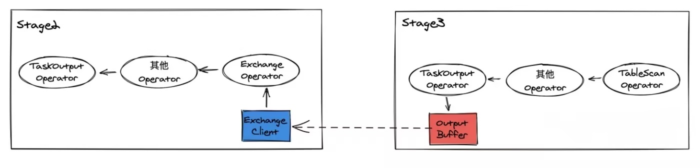

Presto在实现这一套机制的时候，做了比较好的抽象，Stage间的数据交换连同包含TableScanOperator的Stage从Connector取数据这部分，统一实现为拉取数据源（Connector）的ConnectorSplit拉取逻辑，只不过Stage从Connector拉取的是某个Connector实现的ConnectorSplit（如HiveConnector的HiveSplit），Stage之间拉取的是RemoteSplit（RemoteSplit实现了ConnectorSplit的接口）。

**3.10 第十步：【Coordinator】分批返回Query计算结果给SQL客户端**

Presto是流水线（pipeline）的处理方式，数据在Presto的计算过程中是持续流动的。在某个Task内不需要前面的Operator计算完所有数据再输出结果给后面的Operator，在某个Query内也不需要前面的Stage的所有Task都计算完所有数据再输出结果给后面的Stage。因此，从Presto SQL客户端来看，Presto也支持分批返回Query计算结果SQL客户端。Presto这种Pipeline的机制，与Flink非常类似，它们都不像Spark批式处理那样，需要前面的Stage执行完再执行后面的Stage。

如果你有用过MySQL这些关系型数据库，一定听说过游标（cursor），也用过各种编程语言的JDBC Driver的getNext()，通过这样的方式来每次获取SQL执行结果的一部分数据。Presto提供的类似机制是Query提交后，它会给到SQL客户端一个QueryResult，其中包含一个nextUri。对于某个Query，每次请求QueryResult，都会得到一个新的nextUri，它的作用类似游标（cursor）。

我们前面已经讲过Presto内部数据的组织方式Page的概念，Presto SQL Client需要多次向Presto Coordinator发起Http请求，请Coordinator帮忙拉取Query的执行结果。这里还是要说，Presto的抽象确实做的很好，Coordinator拉取Query执行结果的过程利用的也是我们上面介绍过的Stage间的数据交换过程，它使用ExchangeClient到Query的RootStage（最后一个Stage，StageId = 0）的OutputBuffer（代码中叫RootOutputBuffer）拉取数据。

可以看一下以下几个代码实现：

- StatementClientV1::advance()
- ExecutingStatementResource::getQueryResults()
- Query::getNextResult()


## 参考资料

- 本文参考知乎这篇文章，https://zhuanlan.zhihu.com/p/293775390

- 本文用于举例的SQL来自于TPC-DS Benchmark标准Query55，详见 [http://www.tpc.org/tpcds/](https://link.zhihu.com/?target=http%3A//www.tpc.org/tpcds/)

- Presto技术源码解析总结-一个SQL的奇幻之旅(上) [https://www.jianshu.com/p/3fccfa82e](https://link.zhihu.com/?target=https%3A//www.jianshu.com/p/3fccfa82e1ec)

- Presto技术源码解析总结-一个SQL的奇幻之旅(下) [https://www.jianshu.com/p/d8a3d7488](https://link.zhihu.com/?target=https%3A//www.jianshu.com/p/d8a3d7488358)

- 数据库大神 Goetz Graefe与他的论文 [https://scholar.google.com/cita](https://link.zhihu.com/?target=https%3A//scholar.google.com/citations%3Fuser%3DpdDeRScAAAAJ%26hl%3Den)

- SQL 优化之火山模型 [https://zhuanlan.zhihu.com/p/21](https://zhuanlan.zhihu.com/p/219516250)

- Facebook Presto论文，Presto: SQL on Everything

- Volcano 执行模型以及如何用Code Generation与列式存储优化SparkSQL的执行效率 [https://databricks.com/blog/201](https://link.zhihu.com/?target=https%3A//databricks.com/blog/2016/05/23/apache-spark-as-a-compiler-joining-a-billion-rows-per-second-on-a-laptop.html)

- 代码生成技术（二）查询编译执行 https://zhuanlan.zhihu.com/p/58249033

- SQL 查询的分布式执行与调度 https://zhuanlan.zhihu.com/p/100949808

- Volcano执行模型论文解读 [https://zhuanlan.zhihu.com/p/34](https://zhuanlan.zhihu.com/p/34220915)

- Vectorized and Compiled Queries — Part 1 [https://medium.com/@tilakpatidar](https://link.zhihu.com/?target=https%3A//medium.com/%40tilakpatidar/vectorized-and-compiled-queries-part-1-37794c3860cc)

- Vectorized and Compiled Queries — Part 2 [https://medium.com/@tilakpatida](https://link.zhihu.com/?target=https%3A//medium.com/%40tilakpatidar/vectorized-and-compiled-queries-part-2-cd0d91fa189f)

- Vectorized and Compiled Queries — Part 3 [https://medium.com/@tilakpatida](https://link.zhihu.com/?target=https%3A//medium.com/%40tilakpatidar/vectorized-and-compiled-queries-part-3-807d71ec31a5)

- Presto Core Data Structures: Slice, Block & Page [https://zhuanlan.zhihu.com/p/60](https://zhuanlan.zhihu.com/p/60813087)

- Presto 数据如何进行shuffle [https://zhuanlan.zhihu.com/p/61](https://zhuanlan.zhihu.com/p/61565957)

- Presto 由Stage到Task的旅程 https://zhuanlan.zhihu.com/p/55785284

  