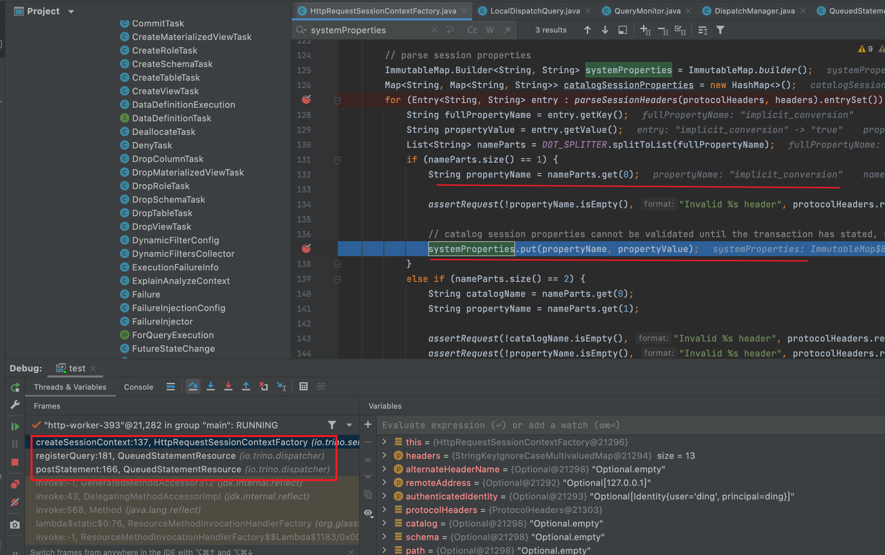
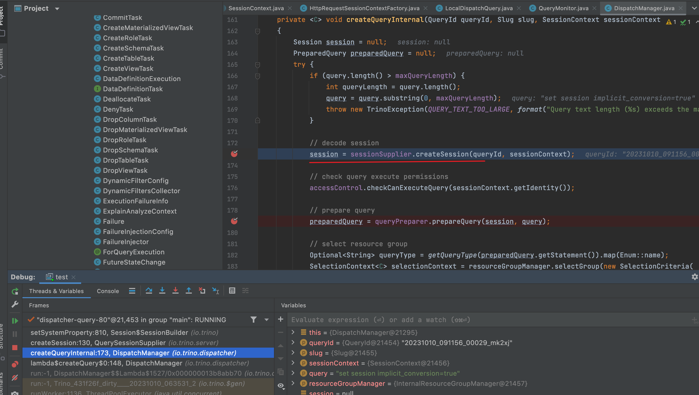
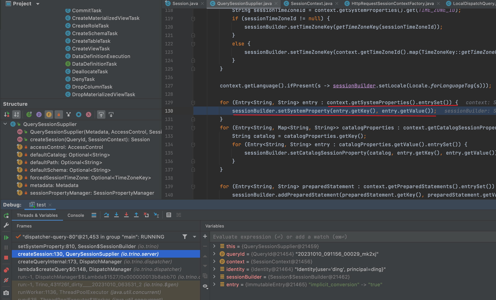
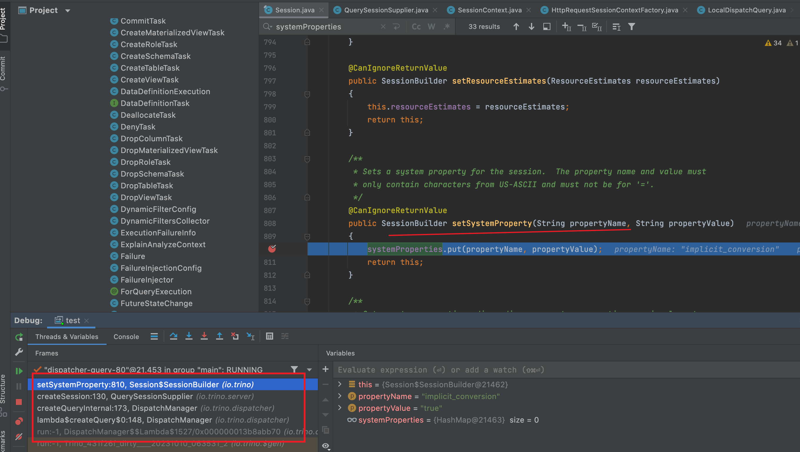

**在第一次set session implicit_conversion=true后，此时的session中的systemProperties并没有 implicit_conversion=true，但是在http的header中进行了保存**

**在接下来的sql查询时，每一条sql请求都会先registerQuery(statement, servletRequest, httpHeaders)，在这个方法里面会由createSessionContext()创建个SessionContext，在这里会将之前的set session参数放入到systemProperties中**

**然后，对每条query都会创建session**

**在创建session时，就会根据context中的参数放入到sessionBuilder中**

