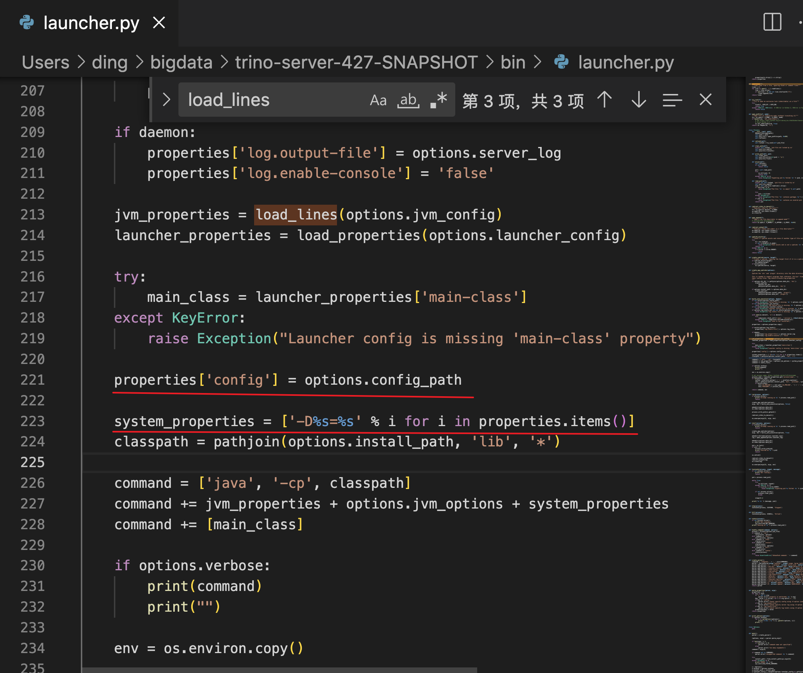
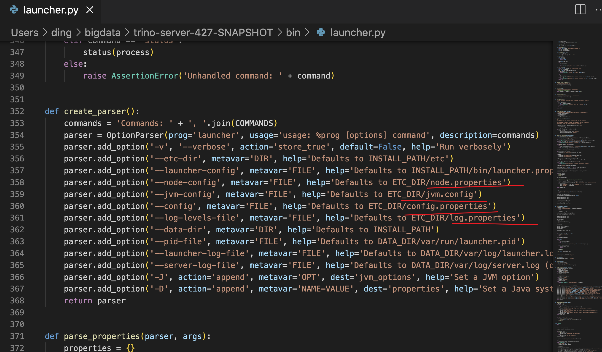
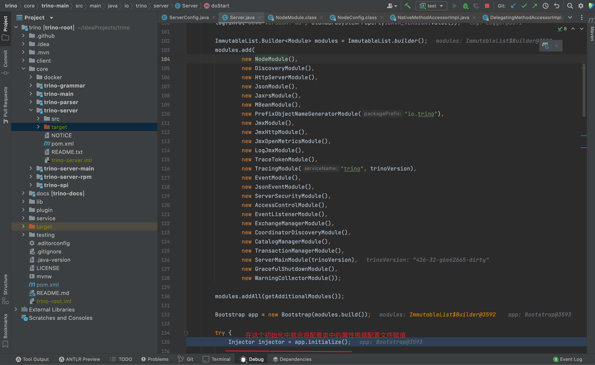
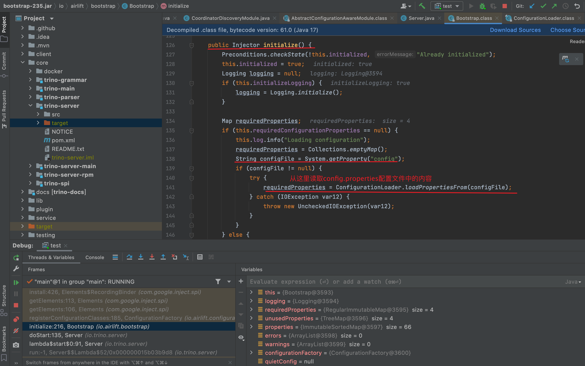
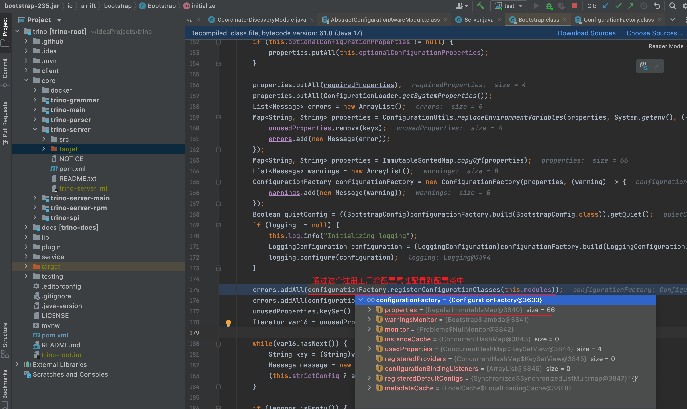
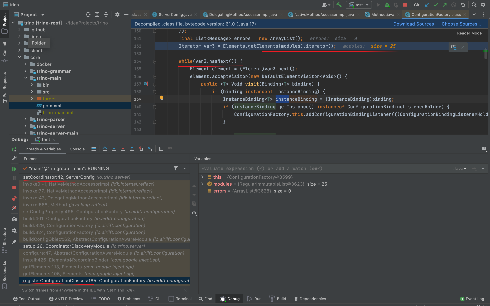
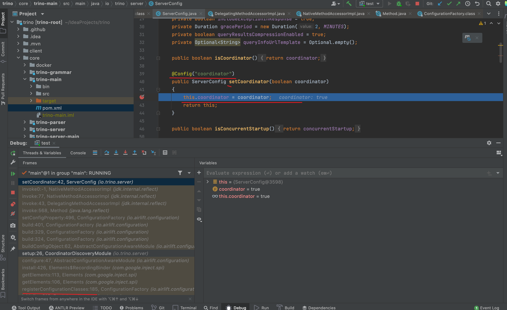

**Presto 基于 Airlift 构建的分布式 SQL 查询引擎，在 Presto 中 Airlift 起着举足轻重的作用，如果 Presto 是座大厦，那么 Airlift 就是大厦的地基。**

**Airlift 是一个可配置的、开箱即用的工具包，帮助开发者提升工作效率，将精力专注于业务实现。**Airlift 提供的工具众多，今天会从基础的 configuration、 bootstrap 和 concurrent 开始介绍。

## 1. configuration

通过注解的方式，将配置文件中的数据绑定到配置类中，接下来我们看下presto是怎么将配置文件的值绑定到配置类**（配置类只需要在set方法中添加@Config就行）**中。

**首先是启动脚本，启动presto服务的命令是bin/launcher start。真正执行的是bin/launcher.py，这个脚本将etc目录下的配置文件给读取出来，并使用-D设置为系统属性的命令行参数，如下图所示**

> 在 Java 中，`-D` 是用于设置系统属性的命令行参数。系统属性是键值对形式的配置项，它们可以在 Java 应用程序中用来控制不同的行为。通过使用 `-D` 参数，您可以在启动 Java 应用程序时为系统属性设置值，例如：
>
> java -Dmyapp.debug=true -jar YourApplication.jar



etc目录下的配置文件都会被这个脚本读取，具体可看下launcher.py。



**此时配置文件中的值已经通过-D放入到系统属性中，然后在presto源码部分，会对这些属性值进行配置，如下图所示**





**上一张图读了config.properties中的配置值，其他配置值是下一张图片画线处进行配置**



**在registerConfigurationClasses方法中，会遍历每个module，对每个module中的配置类进行赋值**






## 2. bootstrap

对象生命周期管理，在 Presto 中用于 Hive、Druid、Hudi 和 Kudu 连接器的生命周期管理，主要目的就是在对象初始化和销毁时执行特定的处理逻辑，注解 @PostConstruct 标识初始化方法，@PreDestroy 标识销毁算法。

> 注意：如果一个类使用了 @PostConstruct或者@PreDestroy注解，一定要在module中对这个类进行绑定。
>
> ```java
> //并且使用这种方式进行添加module
> Bootstrap app = new Bootstrap(new AppModule());
> Injector injector = app.initialize();
> ```

