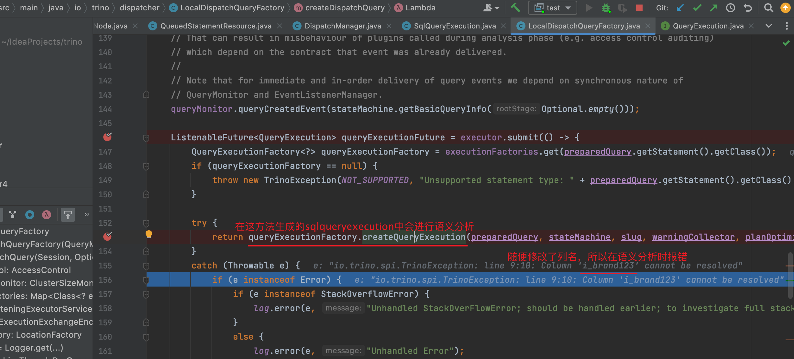

# 语义分析

---

> trino版本是423

## 问题

- 为什么要有语义分析

SQL（Structured Query Language）的语义分析目的是确保查询语句的语法正确，同时也验证查询的语义是否合法，以便数据库系统能够正确执行这些查询。语义分析的主要目标包括：

1. **语法验证：** 首先，语义分析会验证 SQL 查询的语法是否正确。这包括检查查询中的关键字、标识符、操作符等是否按照 SQL 语法规则排列正确。
2. **数据表和列验证：** 语义分析会检查查询中引用的数据表和列是否存在于数据库中。这是为了确保查询操作的对象在数据库中是有效的。
3. **数据类型匹配：** 确保查询中的各种操作符、函数和表达式的数据类型是兼容的。例如，不允许将字符串和数字相加，因此语义分析会检查这些数据类型是否匹配。
4. **权限验证：** 确保查询执行者有足够的权限来执行所提交的查询。这包括对数据表的读取、写入、删除等权限的验证。
5. **查询合法性：** 确保查询的语义合法，不会导致歧义或不一致的结果。例如，不允许在同一查询中使用聚合函数和非聚合列，因为这可能会导致不确定的结果。
6. **优化准备：** 在语义分析阶段，数据库系统还可以根据查询的语义信息为查询生成执行计划。这个执行计划将决定查询的最佳执行方式，以提高查询性能。

总的来说，语义分析是确保 SQL 查询在数据库中正确执行的关键步骤。它有助于防止错误的查询进入数据库系统，同时也为执行查询提供了必要的信息和准备工作。这有助于提高数据库系统的稳定性、安全性和性能。

> 注意，我这里只是修改了列名，所以语法分析时不会报错。如果将from修改为to，在语法分析阶段就会报错，因为语法文件并没有对to进行定义。

- 语义分析的作用

遍历SQL AST，将AST中表达的含义，拆解为多个Map结构以便后续生成执行计划时，不再频繁需要遍历SQL AST。同时还去获取了表和字段的元数据，生成了对应的ConnectorTableHandle, ColumnHandle等与数据源Connector相关的对象实例，也是为了之后拿来即用。在此过程中生成的所有对象，都维护在一个实例化的Analysis对象中，你可以把它理解为是一个Context对象。（如果还是不明白Analysis是什么意思，可以直接看看Analysis.java的源码）